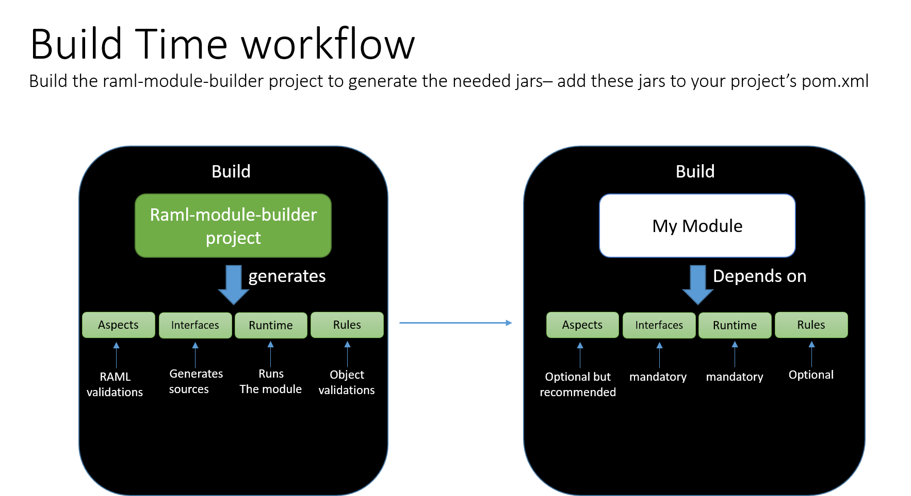
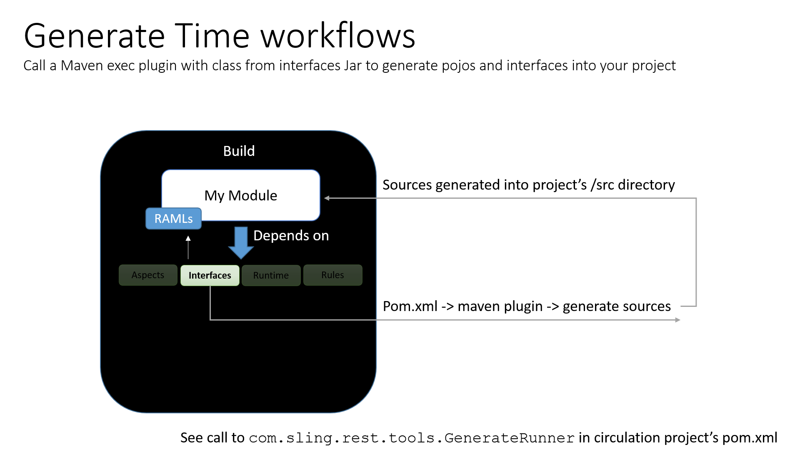

# Raml-Module-Builder

Copyright (C) 2016-2023 The Open Library Foundation

[ClassPath.java](domain-models-api-aspects/src/main/java/org/folio/rest/tools/utils/ClassPath.java) and
[ClassPathTest.java](domain-models-api-aspects/src/test/java/org/folio/rest/tools/utils/ClassPathTest.java)
are also Copyright (C) 2012 The Guava Authors.

This software is distributed under the terms of the Apache License, Version 2.0.
See the file ["LICENSE"](LICENSE) for more information.

<!-- ../okapi/doc/md2toc -l 2 -h 3 README.md -->
* [Introduction](#introduction)
* [Upgrading](#upgrading)
* [Overview](#overview)
* [The basics](#the-basics)
    * [Build-time workflow](#build-time-workflow)
    * [Generate-time workflow](#generate-time-workflow)
    * [Implement the interfaces](#implement-the-interfaces)
    * [Set up your pom.xml](#set-up-your-pomxml)
    * [Build and run](#build-and-run)
* [Get started with a sample working module](#get-started-with-a-sample-working-module)
* [Command-line options](#command-line-options)
* [Environment Variables](#environment-variables)
* [Read and write database instances setup](#read-and-write-database-instances-setup)
* [Asynchronously replicated read and write database instances setup](#read-and-write-database-instances-setup-async)
* [Local development server](#local-development-server)
* [Creating a new module](#creating-a-new-module)
    * [Step 1: Create new project directory layout](#step-1-create-new-project-directory-layout)
    * [Step 2: Include the jars in your project pom.xml](#step-2-include-the-jars-in-your-project-pomxml)
    * [Step 3: Add the plugins to your pom.xml](#step-3-add-the-plugins-to-your-pomxml)
    * [Step 4: Build your project](#step-4-build-your-project)
    * [Step 5: Implement the generated interfaces](#step-5-implement-the-generated-interfaces)
    * [Step 6: Design the RAML files](#step-6-design-the-raml-files)
* [RestVerticle](#restverticle)
* [Adding an init() implementation](#adding-an-init-implementation)
* [Adding code to run periodically](#adding-code-to-run-periodically)
* [Adding a hook to run immediately after verticle deployment](#adding-a-hook-to-run-immediately-after-verticle-deployment)
* [Adding a shutdown hook](#adding-a-shutdown-hook)
* [Implementing uploads](#implementing-uploads)
* [Implement chunked bulk download](#implement-chunked-bulk-download)
* [PostgreSQL integration](#postgresql-integration)
    * [Minimum PostgreSQL server version](#minimum-postgresql-server-version)
    * [Saving binary data](#saving-binary-data)
    * [Securing DB Configuration file](#securing-db-configuration-file)
    * [Foreign keys constraint](#foreign-keys-constraint)
* [CQL (Contextual Query Language)](#cql-contextual-query-language)
    * [CQL2PgJSON: CQL to PostgreSQL JSON converter](#cql2pgjson-cql-to-postgresql-json-converter)
    * [CQL2PgJSON: Usage](#cql2pgjson-usage)
    * [CQL: Field names](#field-names)
    * [CQL: Relations](#cql-relations)
    * [CQL: Modifiers](#cql-modifiers)
    * [CQL: Matching, comparing and sorting numbers](#cql-matching-comparing-and-sorting-numbers)
    * [CQL: Matching id and foreign key fields](#cql-matching-id-and-foreign-key-fields)
    * [CQL: Matching full text](#cql-matching-full-text)
    * [CQL: Matching all records](#cql-matching-all-records)
    * [CQL: Matching undefined or empty values](#cql-matching-undefined-or-empty-values)
    * [CQL: Matching array elements](#cql-matching-array-elements)
    * [CQL: @-relation modifiers for array searches](#cql--relation-modifiers-for-array-searches)
    * [CQL2PgJSON: Multi Field Index](#cql2pgjson-multi-field-index)
    * [CQL2PgJSON: Foreign key cross table index queries](#cql2pgjson-foreign-key-cross-table-index-queries)
    * [CQL2PgJSON: Foreign key tableAlias and targetTableAlias](#cql2pgjson-foreign-key-tablealias-and-targettablealias)
    * [CQL2PgJSON: Exceptions](#cql2pgjson-exceptions)
    * [CQL2PgJSON: Unit tests](#cql2pgjson-unit-tests)
* [Tenant API](#tenant-api)
* [RAMLs API](#ramls-api)
* [JSON Schemas API](#json-schemas-api)
* [Query Syntax](#query-syntax)
* [Estimated totalRecords](#estimated-totalrecords)
* [Metadata](#metadata)
* [Optimistic Locking](#optimistic-locking)
* [Facet Support](#facet-support)
* [JSON Schema fields](#json-schema-fields)
* [Overriding RAML (traits) / query parameters](#overriding-raml-traits--query-parameters)
* [Boxed types](#boxed-types)
* [Messages](#messages)
* [Documentation of the APIs](#documentation-of-the-apis)
* [Logging](#logging)
* [Monitoring](#monitoring)
* [Instrumentation](#instrumentation)
* [Overriding Out of The Box RMB APIs](#overriding-out-of-the-box-rmb-apis)
* [Client Generator](#client-generator)
* [A Little More on Validation](#a-little-more-on-validation)
* [Advanced Features](#advanced-features)
* [Additional Tools](#additional-tools)
* [Some REST examples](#some-rest-examples)
* [Additional information](#additional-information)

## Introduction

This documentation includes information about the Raml-Module-Builder (RMB) framework
and examples of how to use it.

The goal of the project is to abstract away as much boilerplate functionality as
possible and allow a developer to focus on implementing business functions. In
other words: **simplify the process of developing a micro service module**.
The framework is RAML driven, meaning a developer / analyst declares APIs that the
'to be developed' module is to expose (via RAML files) and declares the objects
to be used and exposed by the APIs (via JSON schemas). Once the schemas and RAML
files are in place, the framework generates code and offers a number of tools
to help implement the module.
Note that this framework is both a build and a run-time library.


The framework consists of a number of tools:

- `domain-models-api-interfaces` -- project exposes tools that receive as input
  these RAML files and these JSON schemas, and generates java POJOs and java
  interfaces.

- `domain-models-api-aspects` -- project exposes tools that enforce strict
  adherence to the RAML declaration to any API call by exposing validation
  functionality.

    - for example: a RAML file may indicate that a specific parameter is
      mandatory or that a query parameter value must be a specific regex pattern.
      The aspects project handles this type of validation for developers so that it
      does not need to be re-developed over and over. More on validation
      [below](https://github.com/folio-org/raml-module-builder#a-little-more-on-validation).

- `domain-models-runtime` -- project exposes a run-time library which should be
  used to run a module. It is Vert.x based. When a developer implements the
  interfaces generated by the interfaces project, the run-time library should be
  included in the developed project and run. The run-time library will
  automatically map URLs to the correct implemented function so that developers
  only need to implement APIs, and so all the wiring, validation,
  parameter / header / body parsing, logging (every request is logged in an
  apache like format) is handled by the framework. Its goal is to abstract
  away all boilerplate functionality and allow a module implementation to focus
  on implementing business functions.

    - The runtime framework also exposes hooks that allow developers to
      implement one-time jobs, scheduled tasks, etc.

    - Provides tooling (Postgres client, etc.) for developers
      to use while developing their module.

    - Runtime library runs a Vert.x verticle.

- `rules` -- Basic Drools functionality allowing module developers to create
  validation rules via `*.drl` files for objects (JSON schemas).

## Upgrading

See separate [upgrading notes](doc/upgrading.md) how to upgrade an RMB based module to
a new RMB version.

## Overview

Follow the [Introduction](#introduction) section above to generally understand
the RMB framework.
Review the separate [Okapi Guide and Reference](https://github.com/folio-org/okapi/blob/master/doc/guide.md).
Scan the [Basics](#the-basics) section below for a high-level overview of RMB. Then follow the
[Get started with a sample working module](#get-started-with-a-sample-working-module)
section which demonstrates an already constructed example.
When that is understood, then move on to the section
[Creating a new module](#creating-a-new-module) to get your project started.

Note that actually building this RAML Module Builder framework is not required.
(Some of the images below are out-of-date.) The already published RMB artifacts will
be [incorporated](#step-2-include-the-jars-in-your-project-pomxml) into your project from the repository.

## The basics

### Build-time workflow

Build the `raml-module-builder` project to generate the needed jars, then add them to your project's `pom.xml`.



### Generate-time workflow

Call a Maven exec plugin with a class from the interfaces jar to generate POJOs and interfaces within your project.



See the call to `com.sling.rest.tooks.GenerateRunner` in the circulation project's `pom.xml` for an example.

#### Generated Files

The following RAML snippet will be used for this example:

```raml
/bibs/{bibId}:
  type:
    post:
      example:
        !include examples/bid.sample
      schema:
        bib.schema
```

Additionally, the following query parameters and header requirements will be used:
```raml
headers:
  Authorization:
    description: |
      Used to send a valid JWT token.
    example:
      Bearer Hc8KNK7LAJPasAwX9pIbN7yeTwSCAq
  required: true
queryParameters:
  lang:
    description: |
      Requested language. Optional. [lang=en]
    type: string
    required: false
    default: en
    pattern: "[a-zA-Z]{2}"
```

From this snippet, an interface (`BibInterface.java`) is generated based on the paths (each path+verb pair generates a method).  This is documented with the examples from your RAML.

Additionally, an object (`Bib.java`) is generated based on the JSON Schema provided.  An example of this may be found in the [A Little More on Validation](#a-little-more-on-validation) section.

The following is an example of the interface method signature that would be generated:

```java
void postBibs(
  @HeaderParam("Authorization")
  @NotNull
  String authorization,
  @QueryParam("lang")
  @DefaultValue("en")
  @Pattern(regexp = "[a-zA-Z]{2}")
  String lang,
  Bib entity
) throws Exception;
```

### Implement the interfaces

An example of the generated constraints is shown [above](#generated-files).

- When implementing the interfaces, you must add the @Validate
  annotation to enforce the annotated constraints declared by the interface.
- Note that a Bib entity was passed as a parameter. The runtime framework
  transforms the JSON passed in the body into the correct POJO.


### Set up your pom.xml

- Add Maven repositories for FOLIO. There must be a section for regular
  dependencies (`<repositories>`) and a section for plugins
  (`<pluginRepositories>`).

- Add the `domain-models-maven-plugin`. This will generate the POJOs and interfaces based on
  the RAML files. Use `domain-models-maven-plugin` as a plugin in the `<plugins>` pom.xml
  section only. Please do not add it to the `<dependencies>` section, it is based on
  old libraries with security vulnerabilities. The vulnerabilities do not affect us when
  running `domain-models-maven-plugin` as a plugin but they may affect a module if those
  old dependencies are included as explicit dependencies.

- Add the `aspectj-maven-plugin`. This is required if you
  would like the runtime framework to validate all URLs.

- Add the `maven-shade-plugin`, indicating the main class to
  run as `RestLauncher` and main verticle as `RestVerticle`. This will create a
  runnable jar with the runtime's `RestVerticle` serving as the main class.

- Add the `maven-resources-plugin`. This will copy
  your RAML files to the /apidocs directory where they will be made visible
  online (html view) by the runtime framework.

These are further explained below.

### Build and run

Do `mvn clean install` ... and run :)

The runtime framework will route URLs in your RAML to the correct method
implementation. It will validate (if `@Validate` was used), log, and expose
various tools.

Notice that no web server was configured or even referenced in the implementing
module - this is all handled by the runtime framework.

Some sample projects:

- https://github.com/folio-org/mod-configuration
- https://github.com/folio-org/mod-notes

and other [modules](https://dev.folio.org/source-code/#server-side) (not all do use the RMB).


## Get started with a sample working module

The [mod-organizations-storage](https://github.com/folio-org/mod-organizations-storage)
is a full example which uses the RMB. Clone it, and then investigate:

```
$ git clone --recursive https://github.com/folio-org/mod-organizations-storage.git
$ cd mod-organizations-storage
$ mvn clean install
```

- Its RAMLs and JSON schemas can be found in the `ramls` directory.
These are also displayed as local [API documentation](#documentation-of-the-apis).

- Open the pom.xml file - notice the jars in the `dependencies` section as well as the `plugins` section. The `ramls` directory is declared in the pom.xml and passed to the interface and POJO generating tool via a maven exec plugin. The tool generates source files into the `target/generated-sources/raml-jaxrs` directory. The generated interfaces are implemented within the project in the `org.folio.rest.impl` package.

- Investigate the `src/main/java/org/folio/rest/impl/OrganizationsAPI.java` class. Notice that there is a function representing each endpoint that is declared in the RAML file. The appropriate parameters (as described in the RAML) are passed as parameters to these functions so that no parameter parsing is needed by the developer. Notice that the class contains all the code for the entire module. All handling of URLs, validations, objects, etc. is all either in the RMB jars, or generated for this module by the RMB at build time.

- **IMPORTANT NOTE:** Every interface implementation - by any module -
  must reside in package `org.folio.rest.impl`. This is the package that is
  scanned at runtime by the runtime framework, to find the needed runtime
  implementations of the generated interfaces.

Now run the module in standalone mode:

```
$ java -jar target/mod-organizations-storage-fat.jar
```

Now send some requests using '[curl](https://curl.haxx.se)' or '[httpie](https://httpie.org)'

At this stage there is not much that can be queried, so stop that quick demonstration now.
After explaining general command-line options, etc.
we will get your local development server running and populated with test data.

## Command-line options

- `-Dhttp.port=8080` Optional -- defaults to 8081

- `-Ddebug_log_package=*` Optional -- Set log level to debug for all packages.
Or use `org.folio.rest.*` for all classes within a specific package,
or `org.folio.rest.RestVerticle` for a specific class.

- `db_connection=[path]` Optional -- path to a JSON config file with
  connection parameters to a PostgreSQL DB

  - for example Postgres: `{"host":"localhost", "port":5432, "maxPoolSize":50,
    "username":"postgres","password":"mysecretpassword", "database":"postgres",
    "charset":"windows-1252", "queryTimeout" : 10000}`

  - path defaults to /postgres-conf.json

  - tries to read a file at the path if the path is absolute

  - if file not found or path is relative tries to read a class path resource with that path

- Other module-specific arguments can be passed via the command line in the format key=value. These will be accessible to implementing modules via `RestVerticle.MODULE_SPECIFIC_ARGS` map.

- Optional JVM arguments can be passed before the `-jar` argument, e.g.
`-XX:+HeapDumpOnOutOfMemoryError`
`-XX:+PrintGCDetails`
`-XX:+PrintGCTimeStamps`
`-Xloggc:C:\Git\circulation\gc.log`

## Environment Variables

RMB implementing modules expect a set of environment variables to be passed in at module startup. The environment variables expected by RMB modules are:

 - DB_HOST
 - DB_PORT
 - DB_USERNAME
 - DB_PASSWORD
 - DB_DATABASE
 - DB_HOST_READER
 - DB_PORT_READER
 - DB_SERVER_PEM
 - DB_QUERYTIMEOUT
 - DB_CHARSET
 - DB_MAXPOOLSIZE
 - DB_MAXSHAREDPOOLSIZE
 - DB_CONNECTIONRELEASEDELAY
 - DB_RECONNECTATTEMPTS
 - DB_RECONNECTINTERVAL
 - DB_EXPLAIN_QUERY_THRESHOLD
 - DB_ALLOW_SUPPRESS_OPTIMISTIC_LOCKING
 - TESTCONTAINERS_POSTGRES_IMAGE

The first five are mandatory, the others are optional.

Environment variables with periods/dots in their names are deprecated in RMB because a period is [not POSIX compliant](http://pubs.opengroup.org/onlinepubs/9699919799/basedefs/V1_chap08.html) and therefore some shells, notably, the BusyBox /bin/sh included in Alpine Linux, strip them (reference: [warning in OpenJDK docs](https://hub.docker.com/_/openjdk/)).

See the [Vert.x Async PostgreSQL Client Configuration documentation](https://vertx.io/docs/vertx-mysql-postgresql-client/java/#_configuration) for the details.

The environment variable `DB_MAXPOOLSIZE` sets the maximum number of concurrent connections for a tenant that one module instance opens. They are only opened if needed. If all connections for a tenant are in use further requests for that tenant will wait until one connection becomes free. Other tenants and other instances of a module are unaffected. The default is 4.

The environment variable `DB_MAXSHAREDPOOLSIZE` sets the maximum number of concurrent connections that one module instance opens. They are only opened if needed. If all connections are in use further requests will wait until one connection becomes free. This way one tenant may block other tenants. If the variable is set `DB_MAXPOOLSIZE` is ignored and all connections are shared across tenants.

Use `DB_SERVER_PEM` (or `server_pem` in the JSON config) to set SSL/TLS certificate(s) in PEM format to validate the PostgreSQL server certificate, this can be the server certificate, the root CA certificate, or the chain of the intermediate CA and the CA certificate. Defaults to none allowing unencrypted connection only. If set requires a TLSv1.3 connection and a valid server certificate, and rejects unencrypted connections.

The environment variable `DB_CONNECTIONRELEASEDELAY` sets the delay in milliseconds after which an idle connection is closed. A connection becomes idle if the query ends, it is not idle if it is waiting for a response. Use 0 to keep idle connections open forever. RMB's default is one minute (60000 ms).

`DB_RECONNECTATTEMPTS` and `DB_RECONNECTINTERVAL` set the maximum number of retries after a connect to the database fails, and how many milliseconds to wait before the next reconnect. Reconnecting is disabled by default.

The environment variable `DB_EXPLAIN_QUERY_THRESHOLD` is not observed by
Postgres itself, but is a value - in milliseconds - that triggers query
execution analysis. If a single query exceeds this threshold, it will be
analyzed by using `EXPLAIN ANALYZE`. Note that this in turn further adds
time to the query, so this should only be executed for slow queries that
needs further attention. The analysis can effectively be turned off by setting
it to a high value (e.g. 300000 ~ 5 minutes). Like the DB-environment
variables, this pertains per RMB-module (process). The default
value of `DB_EXPLAIN_QUERY_THRESHOLD` is 1000 (1 second).

The EXPLAIN ANALYZE - is only performed for PostgresClient.get,
PostgresClient.select and PostgresClient.join. Not for methods such
as PostgresClient.getById or PostgresClient.streamGet.

The environment variable `DB_QUERYTIMEOUT` sets the number of milliseconds after which RMB sends a
<a href=https://www.postgresql.org/docs/14/protocol-flow.html#id-1.10.5.7.10">cancel request</a>
to a running PostgreSQL query. 0 disables this timeout and is the default.
To take effect an RMB based module must get it via PostgresClient.getConnectionConfig().getInteger("queryTimeout")
and pass it to the RMB method that starts the connection, transaction or query.

The environment variables `DB_HOST_READER` and `DB_PORT_READER` are for the synchronously replicated [Read and write database instances setup](#read-and-write-database-instances-setup).

The environment variables `DB_HOST_ASYNC_READER` and `DB_PORT_ASYNC_READER` are for the [Asynchronously replicated read and write database instances setup](#asynchronously-replicated-read-and-write-database-instances-setup).

`DB_ALLOW_SUPPRESS_OPTIMISTIC_LOCKING` is a timestamp in the format `2022-12-31T23:59:59Z`. Setting it disables optimistic locking when sending a record that contains `"_version":-1` before that time, after that time `"_version":-1` is rejected. This applies only to tables with `failOnConflictUnlessSuppressed`, see below. The timestamp ensures that disabling this option cannot be forgotten. Suppressing optimistic locking is known to lead to data loss in some cases, don't use in production, you have been warned!

`TESTCONTAINERS_POSTGRES_IMAGE` changes the PostgreSQL container image name used at build time for testing; it is not used at runtime.

See the [Environment Variables](https://github.com/folio-org/okapi/blob/master/doc/guide.md#environment-variables) section of the Okapi Guide for more information on how to deploy environment variables to RMB modules via Okapi.

## Read and write database instances setup
A PostgreSQL instance (the write instance) can be replicated for horizontal scaling (scale out), each replica is a read-only standby instance.

RMB supports separating read and write requests. By default the write instance configured with `DB_HOST` and `DB_PORT` environment variables is used for reading as well, but optionally a read instance (or a load balancer for multiple read instances) can be configured by setting its host and port using the `DB_HOST_READER` and `DB_PORT_READER` environment variables. If either of these reader variables are not set then it will default to use the writer instance.

RMB supports both [synchronous standby servers](https://www.postgresql.org/docs/current/warm-standby.html#SYNCHRONOUS-REPLICATION) and asynchronously replicated standby servers (the default)[https://www.postgresql.org/docs/current/warm-standby.html#STREAMING-REPLICATION]. When using synchronous replication, write instance must list the `DB_HOST_READER` instance(s) in its `synchronous_standby_names` configuration. This ensures ACID for both write and read instance.

PostgreSQL's default asynchronous replication is supported by RMB by configuring `DB_HOST_ASYNC_READER` and `DB_PORT_ASYNC_READER`. Asynchronous replication is eventually consistent and suitable for read-only applications like reporting, analytics, and data warehousing. To use the async read host in queries, get an instance of `PostgresClient` using `PostgresClientWithAsyncReadConn.getInstance(...)`.

AWS RDS does not support synchronous replication. For AWS it is recommended to only use `DB_HOST` and `DB_HOST_ASYNC_READER` in a given deployment.

APIs using the async client should provide a warning in the API documentation that it uses stale data (for performance reasons).

## Local development server

To get going quickly with running a local instance of Okapi, adding a tenant and some test data,
and deploying some modules, see
[Running a local FOLIO system](https://dev.folio.org/guides/run-local-folio/).

## Creating a new module

### Step 1: Create new project directory layout

Create the new project using the [normal layout](https://dev.folio.org/guides/commence-a-module/) of files, and basic POM file.

Add the `/ramls` directory, the area for the RAML, schemas, and examples files.
For a maven subproject the directory may be at the parent project only.

To get a quick start, copy the "ramls" directory and POM file from
[mod-notify](https://github.com/folio-org/mod-notify).
(At [Step 6](#step-6-design-the-raml-files) below, these will be replaced to suit your project's needs.)

Adjust the POM file to match your project, e.g. artifactID, version, etc.

### Step 2: Include the jars in your project pom.xml

```xml
  <repositories>
    <repository>
      <id>folio-nexus</id>
      <name>FOLIO Maven repository</name>
      <url>https://repository.folio.org/repository/maven-folio</url>
    </repository>
  </repositories>
  <pluginRepositories>
    <pluginRepository>
      <id>folio-nexus</id>
      <name>FOLIO Maven repository</name>
      <url>https://repository.folio.org/repository/maven-folio</url>
    </pluginRepository>
  </pluginRepositories>
  <dependencies>
    <dependency>
      <groupId>org.folio</groupId>
      <artifactId>domain-models-runtime</artifactId>
      <version>32.2.0</version>
    </dependency>
    <dependency>
      <groupId>org.folio</groupId>
      <artifactId>postgres-testing</artifactId>
      <version>32.2.0</version>
      <scope>test</scope>
    </dependency>
    ...
    ...
  </dependencies>
```

(postgres-testing is available in version 32.2.0 and later)

### Step 3: Add the plugins to your pom.xml

Four plugins need to be declared in the POM file:

- The `exec-maven-plugin` which will generate the POJOs and interfaces based on
  the RAML files.

- The `aspectj-maven-plugin` which will pre-compile your code with validation aspects
  provided by the framework - remember the `@Validate` annotation. The
  validation supplied by the framework verifies that headers are passed
  correctly, parameters are of the correct type and contain the correct content
  as indicated by the RAML file.

- The `maven-shade-plugin` which will generate a fat-jar runnable jar.
  The important thing to
  notice is the main class that will be run when running your module. Notice the
  `Main-class` and `Main-Verticle` in the shade plugin configuration.

- The `maven-resources-plugin` which will copy the RAML files into a directory
  under `/apidocs` so that the runtime framework can pick it up and display html
  documentation based on the RAML files.

Add `ramlfiles_path` property indicating the location of the RAML directory.

```xml
  <properties>
    <ramlfiles_path>${basedir}/ramls</ramlfiles_path>
  </properties>
```

Compare the POM with other FOLIO RMB-based modules.

### Step 4: Build your project

Do `mvn clean install`

This should:

- Create java interfaces for each added RAML file.

- Each interface will contain functions to be implemented (each function represents
  an API endpoint declared in the RAML).

- The parameters within each function interface will be annotated with
  validation annotations that were declared in the RAML. So, if a trait was
  marked as mandatory, it will be marked as @NOT_NULL. This is not something that
  needs to be handled by the implementer. This is handled by the framework,
  which handles validation.

- POJOs -- The JSON schemas will be generated into java objects.

- All generated code can be found in the `org.folio.rest.jaxrs` package in the
  `target/generated-sources/raml-jaxrs/` directory.

### Step 5: Implement the generated interfaces

Implement the interfaces associated with the RAML files you created. An
interface is generated for every root endpoint in the RAML files.
For example an
`org.folio.rest.jaxrs.resource.Ebooks` interface will be generated.
Note that the `org.folio.rest.jaxrs.resource` will be the package for every
generated interface.

The implementations must go into the `org.folio.rest.impl` package because RMB's
[RestVerticle](https://github.com/folio-org/raml-module-builder/blob/master/domain-models-runtime/src/main/java/org/folio/rest/RestVerticle.java)
scans this package for a class that implements the required interface.  The class can
have any name.
RMB then uses reflection to invoke the constructor and the method.

See [mod-notify's org.folio.rest.impl package](https://github.com/folio-org/mod-notify/tree/master/src/main/java/org/folio/rest/impl)
for example implementations.

### Step 6: Design the RAML files

It is beneficial at this stage to take some time to design and prepare the RAML files for the project.
Investigate the other FOLIO modules for guidance.
The [mod-notify](https://github.com/folio-org/mod-notify/tree/master/ramls) is an exemplar.

Remove the temporary copy of the "ramls" directory from Step 1, and replace with your own.

The end-points that share the same first path segment must go into the same .raml file
because the first path segment determines the name of the resource .java interface, for example
`/foo/bar` and `/foo/baz` should go into foo.raml, and foo.raml will generate
`org/folio/rest/jaxrs/resource/Foo.java`. However, you may
[overrule the convention for the resource interface name](https://github.com/mulesoft-labs/raml-for-jax-rs/issues/111)
by implementing a GeneratorExtension.

Add the shared suite of [RAML utility](https://github.com/folio-org/raml) files
as the "raml-util" directory inside your "ramls" directory:
```
git submodule add https://github.com/folio-org/raml ramls/raml-util
```
The "raml1.0" branch is the current and default branch.

Create JSON schemas indicating the objects exposed by the module.

Use the `description` field alongside the `type` field to explain the content and
usage and to add documentation.

Use `"javaType": "org.folio.rest.jaxrs.model.MyEntity"` to set the class name of the
generated Java type to prevent a duplicate name where the second class overwrites the first class
or to avoid a misleading name. Otherwise the field name in the .json schema file is used as class name.

See [jsonschema2pojo Reference](https://github.com/joelittlejohn/jsonschema2pojo/wiki/Reference)
for JSON schema details.

The GenerateRunner automatically dereferences the schema files and places them into the
`target/classes/ramls/` directory. It scans the `${basedir}/ramls/` directory including
subdirectories, if not found then `${basedir}/../ramls/` supporting maven submodules with
common ramls directory.

The documentation of HTTP response codes
is in [HttpStatus.java](util/src/main/java/org/folio/HttpStatus.java)

Use the collection/collection-item pattern provided by the
[collection resource type](https://github.com/folio-org/raml/tree/raml1.0/rtypes) explained
in the [RAML 200 tutorial](https://raml.org/developers/raml-200-tutorial#resource-types).

The RMB does do some validation of RAML files at compile-time.
There are some useful tools to assist with command-line validation,
and some can be integrated with text editors, e.g.
[raml-cop](https://github.com/thebinarypenguin/raml-cop).

See the guide to [Use raml-cop to assess RAML, schema, and examples](https://dev.folio.org/guides/raml-cop/)
and the [Primer for RAML and JSON Schema](https://dev.folio.org/start/primer-raml/) quick-start document.

RAML-aware text editors are very helpful, such as
[api-workbench](https://github.com/mulesoft/api-workbench) for Atom.

Remember that the POM configuration enables viewing your RAML and interacting
with your application via the local [API documentation](#documentation-of-the-apis).

## RestVerticle

RestVerticle is implemented using the reactor pattern and Vert.x HttpServer and
must be started on the Vert.x event loop. Don't start it on a Vert.x worker context, this
[may fail because of unsupported concurrency](https://issues.folio.org/browse/MODINVSTOR-635).

Use VertxOptions
[setMaxEventLoopExecuteTime](https://vertx.io/docs/apidocs/io/vertx/core/VertxOptions.html#setMaxEventLoopExecuteTime-long-)
and
[setWarningExceptionTime](https://vertx.io/docs/apidocs/io/vertx/core/VertxOptions.html#setWarningExceptionTime-long-)
to adjust warnings like
`Thread vertx-eventloop-thread-3 has been blocked for 20458 ms`
and fix these violations of the [Golden Rule](https://vertx.io/docs/vertx-core/java/#golden_rule)
that make the module unresponsive. For details see [Running blocking code](https://vertx.io/docs/vertx-core/java/#blocking_code).

## Adding an init() implementation

It is possible to add custom code that will run once before the application is deployed
(e.g. to init a DB, create a cache, create static variables, etc.) by implementing
the `InitAPIs` interface. You must implement the
`init(Vertx vertx, Context context, Handler<AsyncResult<Boolean>> resultHandler)`. Only one implementation per module is supported.
Currently the implementation should sit in the
`org.folio.rest.impl` package in the implementing project. The implementation
will run during verticle deployment. The verticle will not complete deployment
until the init() completes. The init() function can do anything basically, but
it must call back the Handler. For example:

```java
public class InitAPIs implements InitAPI {

  public void init(Vertx vertx, Context context, Handler<AsyncResult<Boolean>> resultHandler){
    try {
      sayHello();
      resultHandler.handle(io.vertx.core.Future.succeededFuture(true));
    } catch (Exception e) {
      e.printStackTrace();
      resultHandler.handle(io.vertx.core.Future.failedFuture(e.getMessage()));
    }
  }
}
```

The init may also modify HTTP server options by using `RestVerticle.getHttpServerOptions`.

## Adding code to run periodically

This API can be used if your module *instance* needs to perform ongoing tasks.
Consider using Okapi's
[timer facility](https://github.com/folio-org/okapi/blob/master/doc/guide.md#timer-interface)
if the task to be performed is "per-tenant"
and only needs to be executed on one instance and not all instances of the module.
If the task performs operations on persistent storage, that is typically a sign
that it should be using the Okapi timer facility (not what is presented in this section).

It is possible to add custom code that will run periodically. For example,
to ongoingly check status of something in the system and act upon that.

Need to implement the PeriodicAPI interface:

```java
public interface PeriodicAPI {
  /** this implementation should return the delay in which to run the function */
  public long runEvery();
  /** this is the implementation that will be run every runEvery() milliseconds*/
  public void run(Vertx vertx, Context context);

}
```

For example:

```java
public class PeriodicAPIImpl implements PeriodicAPI {


  @Override
  public long runEvery() {
    return 45000;
  }

  @Override
  public void run(Vertx vertx, Context context) {
    try {
      InitAPIs.amIMaster(vertx, context, v-> {
        if(v.failed()){
          //TODO - what should be done here?
        }
      });
    } catch (Exception e) {
      e.printStackTrace();
    }
  }
```

There can be multiple implementations of the periodic hook, all will be called by the RMB framework.

## Adding a hook to run immediately after verticle deployment

It is possible to add custom code that will be run immediately after the verticle running the module is deployed.

```java
public interface PostDeployVerticle {

  /** this implementation will be run immediately after the verticle is initially deployed. Failure does not stop
   * deployment success. The implementing function MUST call the resultHandler to pass back
   * control to the verticle, like so: resultHandler.handle(io.vertx.core.Future.succeededFuture(true));
   * if not, this function will hang the verticle during deployment */
  public void init(Vertx vertx, Context context, Handler<AsyncResult<Boolean>> resultHandler);

}
```

An implementation example:

```java
public class InitConfigService implements PostDeployVerticle {

  @Override
  public void init(Vertx vertx, Context context, Handler<AsyncResult<Boolean>> handler) {

    System.out.println("Getting secret key to decode DB password.");
    /** hard code the secret key for now - in production env - change this to read from a secure place */
    String secretKey = "b2+S+X4F/NFys/0jMaEG1A";
    int port = context.config().getInteger("http.port");
    AdminClient ac = new AdminClient("http://localhost:" + port, null);
    ac.postSetAESKey(secretKey, reply -> {
      if(reply.statusCode() == 204){
        handler.handle(io.vertx.core.Future.succeededFuture(true));
      }
      else{
        handler.handle(io.vertx.core.Future.failedFuture(reply.statusCode() + ", " + reply.statusMessage()));
      }
    });
  }

}
```

## Adding a shutdown hook

It is possible to add custom code that will run just before the verticle is
undeployed and the JVM stopped. This will occur on graceful shutdowns, but can
not be guaranteed to run if the JVM is forcefully shutdown.

The interface to implement:

```java
public interface ShutdownAPI {

  public void shutdown(Vertx vertx, Context context, Handler<AsyncResult<Void>> handler);

}
```

An implementation example:

```java
public class ShutdownImpl implements ShutdownAPI {

  @Override
  public void shutdown(Vertx vertx, Context context, Handler<AsyncResult<Void>> handler) {
    try {
      AuditLogger.getInstance().publish(new LogRecord(Level.INFO, "closing audit logger"));
      AuditLogger.getInstance().close();
      handler.handle(io.vertx.core.Future.succeededFuture());
    }
    catch (Exception e) {
      e.printStackTrace();
      handler.handle(io.vertx.core.Future.failedFuture(e.getMessage()));
    }
  }
}
```


Note that when implementing the generated interfaces it is possible to add a constructor to the implementing class. This constructor will be called for every API call. This is another way you can implement custom code that will run per request.


## Implementing uploads

The RMB allows for content to be streamed to a specific implemented interface.
For example, to upload a large file without having to save it all in memory:

 - Mark the function to handle the upload with the `org.folio.rest.annotations.Stream` annotation `@Stream`.
 - Declare the RAML as receiving `application/octet-stream`.

Example RAML:

```raml
 /uploadOctet:
    description: Uploads a file
    post:
      description: |
          Uploads a file
      body:
        application/octet-stream:
```


The RMB will then call the function every time a chunk of data is received.
This means that a new Object is instantiated by the RMB for each chunk of
data, and the function of that object is called with the partial data included in a `java.io.InputStream` object.

For each invocation, RMB adds header `streamed_id` which will be unique
for the current stream. For the last invocation, header `complete` is supplied
to indicate "end-of-stream".

As of RMB 23.12.0 and later, if an HTTP client prematurely closes the upload
before complete, the handler will be called with `streamed_abort`.

## Implement chunked bulk download

RMB supports bulk downloads of chunks using [CQL](#cql-contextual-query-language) ordered by primary key id (since version 25).

* 1st CQL query: `cql.allRecords=1 sortBy id`
* 2nd CQL query: `id > [last id from 1st CQL query] sortBy id`
* 3rd CQL query: `id > [last id from 2nd CQL query] sortBy id`
* ...

The chunk size is set using the API's limit parameter, for example `limit=10000`
for chunks of 10000 records each.

## PostgreSQL integration

The PostgreSQL connection parameters locations are searched in this order:

- org.folio.rest.tools.utils.Envs.setEnv
- [DB_* environment variables](#environment-variables)
- Configuration file, defaults to `resources/postgres-conf.json` but can be set via [command-line options](#command-line-options)

With `PostgresClient.setPostgresTester`, testing may be performed against
an instance implementing `postgresTester` interface, for example
[TestContainers Postgres Module](https://www.testcontainers.org/modules/databases/postgres/).
If database configuration is already provided, this call is ignored and testing
is performed against the database instance given by configuration.

The runtime framework exposes a PostgreSQL async client which offers CRUD
operations in an ORM type fashion.
https://github.com/folio-org/raml-module-builder/blob/master/domain-models-runtime/src/main/java/org/folio/rest/persist/PostgresClient.java

**Important Note:** The PostgreSQL client currently implemented assumes
JSONB tables in PostgreSQL. This is not mandatory and developers can work with
regular PostgreSQL tables but will need to implement their own data access
layer.

**Important Note:** For performance reasons the Postgres client will return accurate counts for result sets with less than 50,000 results. Queries with over 50,000 results will return an estimated count.

The PostgresClient expects tables in the following format:

```sql
create table <schema>.<table_name> (
  id UUID PRIMARY KEY,
  jsonb JSONB NOT NULL
);
```

This means that all the fields in the JSON schema (representing the JSON object) **are** the "jsonb" (column) in the Postgres table.

### Minimum PostgreSQL server version

The minimum PostgreSQL server version for RMB 34.0 is 12.0.0. RMB fails a POST /_/tenant call if the actual version is lower. You may set a higher or lower requirement using [server_version_num format](https://www.postgresql.org/docs/current/runtime-config-preset.html#GUC-SERVER-VERSION-NUM):

```
public class TenantRefAPI extends TenantAPI {
  @Validate
  @Override
  public void postTenant(TenantAttributes tenantAttributes, Map<String, String> headers,
                         Handler<AsyncResult<Response>> handler, Context context)  {
    // https://www.postgresql.org/docs/current/runtime-config-preset.html#GUC-SERVER-VERSION-NUM
    context.putLocal("postgres_min_version_num", "100000");
    context.putLocal("postgres_min_version", "10.0");  // human readable, for error message only
    super.postTenant(tenantAttributes, headers, handler, context);
  }
}
```

### Saving binary data

As indicated, the PostgresClient is jsonb oriented. If there is a need to store data in binary form, this can be done in the following manner (only id based upsert is currently supported):
```
byte[] data = ......;
JsonArray jsonArray = new JsonArray().add(data);
client.upsert(TABLE_NAME, id, jsonArray, false, replyHandler -> {
.....
});
```

### Securing DB Configuration file

As previously mentioned, the Postgres Client supplied by the RMB looks for a file called `postgres-conf.json`. However, leaving a file which contains the DB password to a superuser in plain text on the server is not a good idea. It is possible to encrypt the password in the file. The encryption should be an AES encryption (symmetric block cipher). This encryption is done with a secret key.

Meaning: password in plain text + secret key = encrypted password

The RMB comes with an AES class that supports generating secret keys, encrypting and decrypting them, https://github.com/folio-org/raml-module-builder/blob/master/domain-models-runtime/src/main/java/org/folio/rest/security/AES.java

Note that the use of this class is optional.

To work with an encrypted password the RMB exposes an API that can be used to set the secret key (stored only in memory). When creating the DB connection the RMB will check to see if the secret key has been set. If the secret key has been set, the RMB will decrypt the password with the secret key, and use the decrypted password to connect to the DB. Otherwise it will assume an un-encrypted password, and will connect using that password as-is.
A module can also set the secret key via the static method `AES.setSecretKey(mykey)`

The needed steps are:

 -  Generate a key
 -  Encrypt a password
 -  Include that password in the config file
 -  Either call `AES.setSecretKey(mykey)` or the `admin/set_AES_key` API (to load the secret key into memory)

A good way for a module to set the secret key is by using the post deployment hook interface in the RMB.

```java
public class InitConfigService implements PostDeployVerticle {
  @Override
  public void init(Vertx vertx, Context context, Handler<AsyncResult<Boolean>> handler) {
    System.out.println("Getting secret key to decode DB password.");
    //** hard code the secret key  - in production env - read from a secure place *//
    String secretKey = "b2%2BS%2BX4F/NFys/0jMaEG1A";
    int port = context.config().getInteger("http.port");
    AdminClient ac = new AdminClient("http://localhost:" + port, null);
    ac.postSetAESKey(secretKey, reply -> {
      if(reply.statusCode() == 204){
        handler.handle(io.vertx.core.Future.succeededFuture(true));
      }
      else{
        handler.handle(io.vertx.core.Future.failedFuture(reply.statusCode() + ", " + reply.statusMessage()));
      }
    });
    handler.handle(io.vertx.core.Future.succeededFuture(true));
  }
}
```

### Foreign keys constraint

A `foreignKeys` entry in schema.json of the Tenant API automatically creates the following columns, triggers and indexes for the foreign key.

This additional column is needed because PostgreSQL does not directly support a foreign key constraint (referential integrity) of a field inside the JSONB.

Example, similar to the SQL produced by a `foreignKeys` entry:

```sql
CREATE TABLE item (
  id UUID PRIMARY KEY,
  jsonb JSONB NOT NULL,
  permanentLoanTypeId UUID REFERENCES loan_type,
  temporaryLoanTypeId UUID REFERENCES loan_type
);
CREATE OR REPLACE FUNCTION update_item_references()
RETURNS TRIGGER AS $$
BEGIN
  NEW.permanentLoanTypeId = NEW.jsonb->>'permanentLoanTypeId';
  NEW.temporaryLoanTypeId = NEW.jsonb->>'temporaryLoanTypeId';
  RETURN NEW;
END;
$$ language 'plpgsql';
CREATE TRIGGER update_item_references
  BEFORE INSERT OR UPDATE ON item
  FOR EACH ROW EXECUTE PROCEDURE update_item_references();
CREATE INDEX IF NOT EXISTS ON item (permanentLoanTypeId);
CREATE INDEX IF NOT EXISTS ON item (temporaryLoanTypeId);
```

CQL2PgJSON automatically uses this extracted column and its index whenever the foreign key is used.

The overhead of this trigger and foreign key constraint reduces the number of UPDATE transactions per second on this table by about 10% (when tested against an external stand alone Postgres database).  See
https://github.com/folio-org/raml-module-builder/blob/master/domain-models-runtime/src/test/java/org/folio/rest/persist/ForeignKeyPerformanceIT.java
for the performance test.  Doing the foreign key check manually by sending additional SELECT queries takes much more time than 10%.

See also [foreign key CQL support](#cql2pgjson-foreign-key-cross-table-index-queries).

## CQL (Contextual Query Language)

Further [CQL](https://dev.folio.org/reference/glossary/#cql) information.

### CQL2PgJSON: CQL to PostgreSQL JSON converter

The source code is at [./cql2pgjson](cql2pgjson) and [./cql2pgjson-cli](cql2pgjson-cli)

### CQL2PgJSON: Usage

Invoke like this:

```java
// users.user_data is a JSONB field in the users table.
CQL2PgJSON cql2pgJson = new CQL2PgJSON("users.user_data");
String cql = "name=Miller";
String where = cql2pgJson.cql2pgJson(cql);
String sql = "select * from users where " + where;
// select * from users
// where CAST(users.user_data->'name' AS text)
//       ~ '(^|[[:punct:]]|[[:space:]])Miller($|[[:punct:]]|[[:space:]])'
```

Or use `toSql(String cql)` to get the `ORDER BY` clause separately:

```java
CQL2PgJSON cql2pgJson = new CQL2PgJSON("users.user_data");
String cql = "name=Miller";
SqlSelect sqlSelect = cql2pgJson.toSql(cql);
String sql = "select * from users where " + sqlSelect.getWhere()
                           + " order by " + sqlSelect.getOrderBy();
```

Setting server choice indexes is possible, the next example searches `name=Miller or email=Miller`:

```java
CQL2PgJSON cql2pgJson = new CQL2PgJSON("users.user_data", Arrays.asList("name", "email"));
String cql = "Miller";
String where = cql2pgJson.cql2pgJson(cql);
String sql = "select * from users where " + where;
```

Searching across multiple JSONB fields works like this. The _first_ json field specified
in the constructor will be applied to any query arguments that aren't prefixed with the appropriate
field name:

```java
// Instantiation
CQL2PgJSON cql2pgJson = new CQL2PgJSON(Arrays.asList("users.user_data","users.group_data"));

// Query processing
where = cql2pgJson.cql2pgJson( "users.user_data.name=Miller" );
where = cql2pgJson.cql2pgJson( "users.group_data.name==Students" );
where = cql2pgJson.cql2pgJson( "name=Miller" ); // implies users.user_data
```

### CQL: Field names

The field names (keys in JSON) are case sensitive. This is against the CQL specification of index names.

### CQL: Relations

Only these relations have been implemented yet:

* `=` (this is `==` for number matching and `adj` for a string matching.
       Examples 1: `height =/number 3.4` Example 2: `title = Potter`)
* `==` (field match, for example `barcode == 883746123` or field prefix match `title == "Harry Pott*"`
        matching "Harry Potter and the chamber of secrets" but not "Science of Harry Potter";
        `==/number` matches any form: 3.4 = 3.400 = 0.34e1)
* `all` (each word of the query string exists somewhere, `title all "Potter Harry"` matches "Harry X. Potter")
* `any` (any word of the query string exists somewhere, `title any "Potter Foo"` matches "Harry Potter")
* `adj` (substring phrase match: all words of the query string exist consecutively in that order, there may be any
          whitespace and punctuation in between, `title adj "Harry Potter"` matches "The Harry - . - Potter Story")
* `>` `>=` `<` `<=` `<>` (comparison for both strings and numbers)

Note to mask the CQL special characters by prepending a backslash: * ? ^ " \

Example using [StringUtil](util/src/main/java/org/folio/util/StringUtil.java):

```java
String query = "username==" + StringUtil.cqlEncode(username);
String url = "https://example.com/users?query=" + StringUtil.urlEncode(query);
```

Use quotes if the search string contains a space, for example `title = "Harry Potter"`.

To speed up the `==` field matching use a b-tree `"index"` or `"uniqueIndex"`.

To speed up the word matching use a `"fullTextIndex"`.

The `"caseSensitive"` and `"removeAccents"` configuration of the supporting index in schema.json is
used for all string matching operators; `"fullTextIndex"` is always `"caseSensitive": false`.

Refer to further explanation of [CQL string matching](https://dev.folio.org/faqs/explain-cql/)
for the "Exact match operator" and "Word match operators".

### CQL: Modifiers

Matching modifiers: Only `masked` is implemented, not `unmasked`, `regexp`,
`honorWhitespace`, `substring`.

Word begin and word end in JSON is only detected at whitespace and punctuation characters
from the ASCII charset, not from other Unicode charsets.

### CQL: Matching, comparing and sorting numbers

Add the /number modifier to enable number matching, comparing and sorting, for example `age ==/number 18`,
`age >=/number 21` and `sortBy age/number`.

3.4, 3.400, and 0.34e1 match each other when using `==/number`, and 2 is smaller than 19
(in contrast to string comparison where "2" > "19").

This requires that the value has been stored as a JSONB number (`{"age": 19}`)
and not as a JSONB string (`{"age": "19"}`).

### CQL: Matching id and foreign key fields

The id field and any foreign key field declared in schema.json is a UUID field
and is not searched in the JSONB but in an extracted proper database table field.
An index is automatically created for such a field,
do not add an index entry in schema.json.

`=`, `==`, `<>`, `>`, `>=`, `<`, and `<=` relations are supported for comparison with a valid UUID and use the index.

`=`, `==`, and `<>` relations allow `*` for right truncation with index support.

`=` is interpreted as `==` for the id field and foreign key fields declared in schema.json; for other fields
that contain a UUID `=` results in a word full text match. Therefore `=` should be avoided and `==`
been used for all UUID fields.

Modifiers are forbidden.

### CQL: Matching full text

See [PostgreSQL's tsvector full text parser documentation](https://www.postgresql.org/docs/current/textsearch-parsers.html)
how word splitting works when using a full text index. Some notable consequences:

CQL `field adj "bar"` matches `bar`, `bar-baz`, `foo-bar-baz`.

CQL `field adj "bar baz"` matches `bar baz`, `bar-baz`, `foo-bar-baz`, `foo-bar baz`, `bar-baz-foo`.

CQL `field adj "bar-baz"` matches `bar-baz`, but neither `bar baz` nor `foo-bar-baz` nor `foo-bar baz` nor `bar-baz-foo`.

CQL `field adj "123 456"` matches `123 456`, but not `123-456`.

CQL `field adj "123-456"` matches `123-456`, but not `123 456`.

`foo/bar/baz` is a single word, while `foo//bar//baz`, `foo///bar///baz`, `foo////bar////baz`, etc.
are split into the three words `foo`, `/bar`, and `/baz` (always reduced to a single slash).

### CQL: Matching all records

A search matching all records in the target index can be executed with a
`cql.allRecords=1` (CQL standard) or a `id=*` (RMB specific) query. They can be used alone or as part of
a more complex query, for example
`cql.allRecords=1 NOT name=Smith sortBy name/sort.ascending`

* `cql.allRecords=1 NOT name=Smith` matches all records where name does not contain Smith
   as a word or where name is not defined.
* `name="" NOT name=Smith` matches all records where name is defined but does not contain
   Smith as a word.
* For performance reasons, searching for `*` in any fulltext field will match all records as well,
  including records where that field does not exist.

### CQL: Matching undefined or empty values

A relation does not match if the value on the left-hand side is undefined. (but see the fulltext
`*` case above).
A negation (using NOT) of a relation matches if the value on the left-hand side is
not defined or if it is defined but doesn't match.

* `name=""` matches all records where name is defined.
* `cql.allRecords=1 NOT name=""` matches all records where name is not defined.
* `name==""` matches all records where name is defined and empty.
* `cql.allRecords=1 NOT name==""` matches all records where name is defined and not empty or
   where name is not defined.
* `name="" NOT name==""` matches all records where name is defined and not empty.

### CQL: Matching array elements

For matching the elements of an array use these queries (assuming that lang is either an array or not defined, and assuming
an array element value does not contain double quotes):
* `lang == "[]"` for matching records where lang is defined and an empty array
* `cql.allRecords=1 NOT lang <> "[]"` for matching records where lang is not defined or an empty array
* `lang == "*\"en\"*"` for matching records where lang is defined and contains the value en
* `cql.allRecords=1 NOT lang == "*\"en\"*"` for matching records where lang does not
  contain the value en (including records where lang is not defined)
* `lang = "" NOT lang == "*\"en\"*"` for matching records where lang is defined and
  and does not contain the value en
* `lang = ""` for matching records where lang is defined
* `cql.allRecords=1 NOT lang = ""` for matching records where lang is not defined

### CQL: @-relation modifiers for array searches

RMB 26 or later supports array searches with relation modifiers, that
are particular suited for structures like:

```json5
"property" : [
  {
    "type1" : "value1",
    "type2" : "value2",
    "subfield": "value"
  },
  ...
]
```

An example of this kind of structure is `contributors ` (property) from
mod-inventory-storage . `contributorTypeId` is the type of contributor
(type1).

With CQL you can limit searches to `property` with regular match in
`subfield`, with type1=value1 with

```
property =/@type1=value1 value
```

Observe that the relation modifier is preceded with the @-character to
avoid clash with other CQL relation modifiers.

The type1, type2 and subfield must all be defined in schema.json, because
the JSON schema is not known. And also because relation modifiers are
unfortunately lower-cased by cqljava. To match value1 against the
property contents of type1, full-text match is used.

Multiple relation modifiers with value are ANDed together. So

```
property =/@type1=value1/@type2=value2 value
```

will only give a hit if both type1 has value1 AND type2 has value2.

It is also possible to specify relation modifiers without value. This
essentially is a way to override what subfield to search. In this case
the right hand side term is matched. Multiple relation modifiers
are OR'ed together. For example:

```
property =/@type1 value
```

And to match any of the sub properties type1, type2, you could use:

```
property =/@type1/@type2 value
```

In schema.json two new properties, `arraySubfield` and `arrayModifiers`,
specifies the subfield and the list of modifiers respectively.
This can be applied to `ginIndex` or `fullTextIndex`.
schema.json example:

```json5
{
  "fieldName": "property",
  "tOps": "ADD",
  "caseSensitive": false,
  "removeAccents": true,
  "arraySubfield": "subfield",
  "arrayModifiers": ["type1", "type2"]
}
```

For the identifiers example we could define things in schema.json with:
```json5
{
  "fieldName": "identifiers",
  "tOps": "ADD",
  "arraySubfield": "value",
  "arrayModifiers": ["identifierTypeId"]
}
```
This will allow you to perform searches, such as:
```
identifiers = /@identifierTypeId=7e591197-f335-4afb-bc6d-a6d76ca3bace 6316800312
```

### CQL2PgJSON: Multi Field Index

CQL2PGjson allows generating and querying indexes that contain multiple columns. The index json object now has support for the following properties:
* `sqlExpression`
	Allows the user to explicitly define the expression they wish to use in the index
	```json5
  "fieldName": "address",
  "sqlExpression": "concat_space_sql(jsonb->>'city', jsonb->>'state')",
	```

* `multiFieldNames`
	This is a comma-separated list of json fields that are to be concatenated together via concat_ws with a space character.
	example:
	```json5
		"fieldName": "address",
		"multiFieldNames": "city,state",
	```
These 2 examples are equivalent and would be queried by using the fieldName such as:

```
address = Boston MA
```

These fields are optional but mutually exclusive, you only need one of them.


### CQL2PgJSON: Foreign key cross table index queries

CQL2PgJSON supports cross table joins via subquery based on foreign keys.
This allows arbitrary depth relationships in both child-to-parent (many-to-one) and parent-to-child (one-to-many) direction.

Example relationship: item → holdings_record → instance

Join conditions of this example:
* item.holdingsRecordId = holdings_record.id
* holdings_record.instanceId = instance.id

The field in the child table points to the primary key `id` field of the parent table; the parent table is also called the target table.

* Precede the index you want to search, with the table name in camelCase, e.g. `instance.title = "bee"`.
* There is no change with child table fields. Use them in the regular way without table name prefix.
* The `foreignKey` entry in schema.json automatically creates an index on the foreign key field.
* For fast queries, declare an index on any other searched field like `title` in the schema.json file.
* For a multi-table join, use `targetPath` instead of `fieldName` and put the list of field names into the `targetPath` array.
  The `targetPath` array must be in child-to-parent direction (many-to-one), e.g. item → holdings_record → instance, queries are possible in both directions.
* When querying in parent → child direction each sub-expression may refer to a different child/grandchild/...:
Searching for instances using `item.status.name=="Missing" and item.effectiveLocationId="fcd64ce1-6995-48f0-840e-89ffa2288371"`
will look for an instance that has at least one item that is missing and this or some other item of the instance has the effective location.
Use a child-to-parent query against the item endpoint if both conditions should apply to the same item record.
* Use `= *` to check whether a join record exists. This runs a cross index join with no further restriction, e.g. `instance.id = *`.
* The sortBy clause doesn't support foreign table fields. Use the API endpoint of the records with the field you want to sort on.
* The schema for the above example:
```json
{
  "tables": [
    {
      "tableName": "instance",
      "index": [
        {
          "fieldName": "title",
          "tOps": "ADD",
          "caseSensitive": false,
          "removeAccents": true
        }
      ]
    },
    {
      "tableName": "holdings_record",
      "foreignKeys": [
        {
          "fieldName": "instanceId",
          "targetTable":      "instance",
          "targetTableAlias": "instance",
          "tableAlias": "holdingsRecord",
          "tOps": "ADD"
        }
      ]
    },
    {
      "tableName": "item",
      "foreignKeys": [
        {
          "fieldName": "holdingsRecordId",
          "targetTable":      "holdings_record",
          "targetTableAlias": "holdingsRecord",
          "tableAlias": "item",
          "tOps": "ADD"
        },
        {
          "targetPath": ["holdingsRecordId", "instanceId"],
          "targetTable":      "instance",
          "targetTableAlias": "instance",
          "tableAlias": "item"
        }
      ]
    }
  ]
}
```

### CQL2PgJSON: Foreign key tableAlias and targetTableAlias

The property `targetTableAlias` enables that parent table name in CQL queries against the current child table.

The property `tableAlias` enables that child table name in CQL queries against the target/parent table.

If any of these two properties is missing, then that respective foreign key join syntax is disabled.

The name may be different from the table name (`tableName`, `targetTable`). One use case is to change to camelCase, e.g.
`"targetTable": "holdings_record"` and `"targetTableAlias": "holdingsRecord"`. Another use case is
to resolve ambiguity when two foreign keys point to the same target table, example:
```json
{
  "tableName": "item",
  "foreignKeys": [
    {
      "fieldName": "permanentLoanTypeId",
      "tableAlias": "itemWithPermanentLoanType",
      "targetTable": "loan_type",
      "targetTableAlias": "loanType",
      "tOps": "ADD"
    },
    {
      "fieldName": "temporaryLoanTypeId",
      "tableAlias": "itemWithTemporaryLoanType",
      "targetTable": "loan_type",
      "targetTableAlias": "temporaryLoanType",
      "tOps": "ADD"
    }
  ]
}
```
Running CQL `loanType.name == "Can circulate"` against the item endpoint returns all items where the item's permanentLoanTypeId points to a loan_type where the loan_type's name equals "Can circulate".

Running CQL `temporaryLoanType.name == "Can circulate"` against the item endpoint returns all items where the item's temporaryLoanTypeId points to a loan_type where the loan_type's name equals "Can circulate".

Running CQL `itemWithPermanentLoanType.status == "In transit"` against the loan_type endpoint returns all loan_types where there exists an item that has this loan_type as a permanentLoanType and where the item's status equals "In transit".

Running CQL `itemWithTemporaryLoanType.status == "In transit"` against the loan_type endpoint returns all loan_types where there exists an item that has this loan_type as a temporaryLoanType and where the item's status equals "In transit".

### CQL2PgJSON: Exceptions

All locally produced Exceptions are derived from a single parent so they can be caught collectively
or individually. Methods that load a JSON data object model pass in the identity of the model as a
resource file name, and may also throw a native `java.io.IOException`.

```
CQL2PgJSONException
  ├── FieldException
  ├── SchemaException
  ├── ServerChoiceIndexesException
  ├── CQLFeatureUnsupportedException
  └── QueryValidationException
        └── QueryAmbiguousException
```

### CQL2PgJSON: Unit tests

To run the unit tests in your IDE, the Unicode input files must have been produced by running maven.
In Eclipse you may use "Run as ... Maven Build" for doing so.

## Tenant API

The Postgres Client support in the RMB is schema specific, meaning that
it expects every tenant to be represented by its own schema. The Tenant
API is asynchronous as of RMB 32 and later. The tenant job is initiated
by a POST and may be inspected with GET and optionally be cleaned up
with DELETE.

The RAML defining the API:

   https://github.com/folio-org/raml/blob/tenant_v2_0/ramls/tenant.raml

By default RMB includes an implementation of the Tenant API which assumes
Postgres being present.
Implementation in
 [TenantAPI.java](https://github.com/folio-org/raml-module-builder/blob/master/domain-models-runtime/src/main/java/org/folio/rest/impl/TenantAPI.java) file. You might want to extend/override this because:

1. You want to not call it at all (your module is not using Postgres).
2. You want to provide further Tenant control, such as loading reference and/or sample data.

#### Extending the Tenant API

Since RMB 32, the postTenant that is provided is working in
an asynchronous fashion. The handler provided will be called
very early in the process and before `schema.json` is fully processed.
For this reason doing anything in the handler is problematic as the
database is not fully populated with data. Furthermore, if there are
any errors that could occur in your post handler, it seems natural to
throw an error, but the underlying RMB code does not know about that, and
thus, continues its operation - including managing a job in the background.

Here's an example of incorrect usage.
DO NOT DO THIS:

```java
  super.postTenant(entiry, headers, ar -> {
     LiquibaseUtil.initializeSchemaForTenant(vertx, tenantId);
     if (someerror) {
       handler.handle(Future.succeededFuture(
              PostTenantResponse.respond400TextPlain(...)));
     }
  }, context);
```

The `LiquibaseUtil.initializeSchemaForTenant`
assumes that the database is configured. The handler is called when the module
is invoked always (on purge, disable as well). Throwing error is problematic
because postTenant has already done something. And, finally, the status
code of `ar` is not even inspected.

For these reasons, in most cases, it is discouraged to call
`super.postTenant`. Instead extend the `loadData` method (see below).

If your module - based on RMB - does not use a storage then there is not
a problem - you must not call `super.postTenant` and you can just
implement an easy postTenant implementation in sync fashion -
returning 204 for OK/No Content.

Extend the `loadData` method, to load sample/reference data for a module
or do any other initialiation of a module - such as doing LiquibaseUtil
work. The loadData is called upon create/upgrade.


```java
@Validate
@Override
Future<Integer> loadData(TenantAttributes attributes, String tenantId,
                         Map<String, String> headers, Context vertxContext) {
  return super.loadData(attributes, tenantId, headers, vertxContext)
      .compose(superRecordsLoaded -> {
        // load n records or any other initialization
        return Future.succeededFuture(superRecordsLoaded + n);
      });
}
```

The Integer here is the number of records loaded - just add 0 if
no sample/ref is loaded.

There is no right way to load data, but consider that data load will be
both happening for first time tenant usage of the module and during an
upgrade process. Your data loading should be idempotent. If files are stored
as resources and as JSON files, you can use the TenantLoading utility.

```java
import org.folio.rest.tools.utils.TenantLoading;

@Validate
@Override
Future<Integer> loadData(TenantAttributes attributes, String tenantId,
                         Map<String, String> headers, Context vertxContext) {
  return super.loadData(attributes, tenantId, headers, vertxContext)
      .compose(recordsLoaded -> new TenantLoading()
          // two sets of reference data files
          // resources ref-data/data1 and ref-data/data2 .. loaded to
          // okapi-url/instances and okapi-url/items respectively
          .withKey("loadReference").withLead("ref-data")
          .withIdContent()
          .add("data1", "instances")
          .add("data2", "items")
          .perform(attributes, headers, vertxContext, recordsLoaded));
}
```

If data is already in resources, then fine. If not, then copy it with maven-resource-plugin.
For example, to copy `reference-data` to `ref-data` in resources:

```xml
<execution>
  <id>copy-reference-data</id>
  <phase>process-resources</phase>
  <goals>
    <goal>copy-resources</goal>
  </goals>
  <configuration>
    <outputDirectory>${basedir}/target/classes/ref-data</outputDirectory>
    <resources>
      <resource>
        <directory>${basedir}/reference-data</directory>
        <filtering>true</filtering>
      </resource>
    </resources>
  </configuration>
</execution>
```

#### Unit testing

For unit testing method `TenantAPI.postTenantSync` may be used
to initialize the tenant. This method is a straight API call and is
not called via HTTP. Use it before/after using our own provided
interfaces in `org.folio.rest.impl`. Example:

```java
// create
TenantAPI tenantAPI = new TenantAPI();
TenantAttributes tenantAttributes = new TenantAttributes();
tenantAttributes.setModuleTo("mod-2.0.0");
tenantAPI.postTenantSync(tenantAttributes, okapiHeaders, context.asyncAssertSuccess(result ->
  assertThat(result.getStatus(), is(204))
), vertx.getOrCreateContext());
```

A HTTP based alternatives is `TenantInit.exec` with a similar interface. Example:
```java
TenantClient client = new TenantClient(....);
TenantAttributes tenantAttributes = new TenantAttributes().withModuleTo("mod-2.0.0");
TenantInit.exec(client, tenantAttributes, 60000).onComplete(context.asyncAssertSuccess());
```

#### The Post Tenant API

The Postgres based Tenant API implementation will look for a file at `/resources/templates/db_scripts/`
called **schema.json**

The file contains an array of tables and views to create for a tenant on registration (tenant api post)

An example can be found here:

 - https://github.com/folio-org/raml-module-builder/blob/master/domain-models-runtime/src/main/resources/templates/db_scripts/examples/schema.json.example.json

The top level properties in schema.json (some of which are optional) are `scripts`, `tables`, `views` and `exactCount`.

Entries in the json file to be aware of:

For each **table** in `tables` property:

1. `tableName` - name of the table that will be generated - this is the table that should be referenced from the code. Maximum length is 49 characters.
2. `generateId` - No longer supported.  This functionality is not stable in Pgpool-II see https://www.pgpool.net/docs/latest/en/html/restrictions.html.  The solution is to generate a UUID in java in the same manner as https://github.com/folio-org/raml-module-builder/blob/v23.11.0/domain-models-runtime/src/main/java/org/folio/rest/persist/PgUtil.java#L358
3. `fromModuleVersion` - this optional field indicates the version in which the table was created / updated in. When a tenant update is requested - only versions older than the indicated version will generate the declared table. This ensures that if a module upgrades from an older version, the needed tables will be generated for it, however, subsequent upgrades from versions equal or later than the version indicated for the table will not re-generate the table.
    * Note that this is enforced for all tables, views, indexes, FK, triggers, etc. (via the `IF NOT EXISTS` sql Postgres statement)
4. `mode` - should be used only to indicate `delete`
5. `withMetadata` - will generate the needed triggers to populate the metadata section in the json on update / insert
6. `likeIndex` - indicate which fields in the json will be queried using the `LIKE`. Needed for fields that will be faceted on.
    * `fieldName` the field name in the json for which to create the index, maximum name length is 49 characters.
    * the `tOps` indicates the table operation - ADD means to create this index, DELETE indicates this index should be removed
    * the `caseSensitive` allows you to create case insensitive indexes (boolean true / false), if you have a string field that may have different casings and you want the value to be unique no matter the case. Defaults to false.
    *  `removeAccents` - normalize accents or leave accented chars as is. Defaults to true.
    * the `whereClause` allows you to create partial indexes, for example:  "whereClause": "WHERE (jsonb->>'enabled')::boolean = true"
    * `stringType` - defaults to true - if this is set to false than the assumption is that the field is not of type text therefore ignoring the removeAccents and caseSensitive parameters.
    * `arrayModifiers` - specifies array relation modifiers supported for some index. The modifiers must exactly match the name of the property in the JSON object within the array.
    * `arraySubfield` - is the key of the object that is used for the primary term when array relation modifiers are in use. This is typically also defined when `arrayModifiers` are also defined.
    * `multiFieldNames` - see [CQL2PgJSON: Multi Field Index](#cql2pgjson-multi-field-index) above
    * `sqlExpression` - see [CQL2PgJSON: Multi Field Index](#cql2pgjson-multi-field-index) above
    * `sqlExpressionQuery` - How to wrap the query string $ before matching against the index expression. This overwrites any `caseSensitive` and `removeAccents` wrapping. Example that manually implements case insensitive matching: `"sqlExpression": "lower(jsonb->>'name')", "sqlExpressionQuery": "lower($)"`. Example for plain field, note the required braces: `"sqlExpression": "(jsonb->>'name')", "sqlExpressionQuery": "$"`.
    * Do not manually add an index for an `id` field or a foreign key field. They get indexed automatically.
7. `ginIndex` - generate an inverted index on the JSON using the `gin_trgm_ops` extension. Allows for left and right truncation LIKE queries and regex queries to run in an optimal manner (similar to a simple search engine). Note that the generated index is large and does not support the full field match (SQL `=` operator and CQL `==` operator without wildcards). See the `likeIndex` for available options.
8. `uniqueIndex` - create a unique index on a field in the JSON
    * the `tOps` indicates the table operation - ADD means to create this index, DELETE indicates this index should be removed
    * the `whereClause` allows you to create partial indexes, for example:  "whereClause": "WHERE (jsonb->>'enabled')::boolean = true"
    * Adding a record will fail if the b-tree index byte size limit of 2712 is exceeded. Consider enforcing a length limit on the field, for example by adding a 600 character limit (multi-byte characters) to the RAML specification.
    * See additional options in the likeIndex section above
9. `index` - create a btree index on a field in the JSON
    * the `tOps` indicates the table operation - ADD means to create this index, DELETE indicates this index should be removed
    * the `whereClause` allows you to create partial indexes, for example:  "whereClause": "WHERE (jsonb->>'enabled')::boolean = true"
    * See additional options in the likeIndex section above
    * The expression is wrapped into left(..., 600) to prevent exceeding the b-tree byte size limit of 2712. Special case: sqlExpression is not wrapped.
10. `fullTextIndex` - create a full text index using the tsvector features of postgres.
    * `removeAccents` can be used, the default `caseSensitive: false` cannot be changed because tsvector always converts to lower case.
    * See [CQL: Matching full text](#cql-matching-full-text) to learn how word splitting works.
    * The `tOps` is optional (like for all indexes), and defaults to ADDing the index.
    * `whereClause` and `stringType` work as for `likeIndex` above.
11. `withAuditing` - Creates an auditing table and a trigger that populates the audit table with the history of the table record whenever an insert, update, or delete occurs. `"withAuditing": true` for enabled, `false` or undefined for disabled.
    * `auditingTableName` The name of the audit table.
    * `auditingFieldName` The field (JSON property) in the audit record that contains the copy of the original record.
    * `"withAuditing": true` automatically creates the auditing table; an entry of the audit table in the "tables" section of schema.json is optional, for example to create indexes.
    * The `auditingSnippet` section allows some customizations to the auditing function with custom SQL in the declare section and the body (for either insert / update / delete).
    * The audit table jsonb column has three fields: `$auditingFieldName` contains the original record (jsonb from the original table), `id` contains a new unique id, `operation` contains `I`, `U`, `D` for insert, update, delete, and `createdDate` contains the time when the audit record was created.
12. `foreignKeys` - adds / removes foreign keys (trigger populating data in a column based on a field in the JSON and creating a FK constraint)
13. `customSnippetPath` - a relative path to a file with custom SQL commands for this specific table
14. `deleteFields` / `addFields` - delete (or add with a default value), a field at the specified path for all JSON entries in the table
15. `populateJsonWithId` - This schema.json entry and the disable option is no longer supported. The primary key is always copied into `jsonb->'id'` on each insert and update.
16. `pkColumnName` - No longer supported. The name of the primary key column is always `id` and is copied into `jsonb->'id'` in each insert and update. The method PostgresClient.setIdField(String) no longer exists.
17. `withOptimisticLocking` - `off` (default), `logOnConflict`, `failOnConflictUnlessSuppressed`, or `failOnConflict`, for details see [Optimistic Locking section](#optimistic-locking) below

The **views** section is a bit more self explanatory, as it indicates a viewName and the two tables (and a column per table) to join by. In addition to that, you can indicate the join type between the two tables. For example:
```json
"views": [
  {
    "viewName": "items_mt_view",
    "join": [
      {
        "table": {
          "tableName": "item",
          "joinOnField": "materialTypeId"
        },
        "joinTable": {
          "tableName": "material_type",
          "joinOnField": "id",
          "jsonFieldAlias": "mt_jsonb"
        }
      }
    ]
  }
]
```
Behind the scenes this will produce the following statement which will be run as part of the schema creation:

    CREATE OR REPLACE VIEW ${tenantid}_${module_name}.items_mt_view AS
      SELECT u.id, u.jsonb as jsonb, g.jsonb as mt_jsonb
      FROM ${tenantid}_${module_name}.item u
      JOIN ${tenantid}_${module_name}.material_type g
        ON lower(f_unaccent(g.jsonb->>'id')) = lower(f_unaccent(u.jsonb->>'materialTypeId'))

Notice the `lower(f_unaccent(` functions, currently, by default, all string fields will be wrapped in these functions (will change in the future).

A three table join would look something like this:

```json
{
  "viewName": "instance_holding_item_view",
  "join": [
    {
      "table": {
        "tableName": "instance",
        "joinOnField": "id"
      },
      "joinTable": {
        "tableName": "holdings_record",
        "joinOnField": "instanceId",
        "jsonFieldAlias": "ho_jsonb"
      }
    },
    {
      "table": {
        "tableName": "holdings_record",
        "joinOnField": "id",
        "jsonFieldAlias": "ho2_jsonb"
      },
      "joinTable": {
        "tableName": "item",
        "joinOnField": "holdingsRecordId",
        "jsonFieldAlias": "it_jsonb"
      }
    }
  ]
}
```

The **script** section allows a module to run custom SQLs before table / view creation/updates and after all tables/views have been created/updated.

The fields in the **script** section include:

1. `run` - either `before` or `after` the tables / views are generated
2. `snippet` - the SQL to run. There is no variable replacement. Use `snippetPath` if variable replacement or line breaks for readability are needed.
3. `snippetPath` - relative path to a file with SQL script to run. If `snippetPath` is set then `snippet` field will be ignored.
4. `fromModuleVersion` - same as `fromModuleVersion` for table. If no fromModuleVersion is provided the SQL runs on each upgrade. This is reasonable if the SQL runs fast and is idempotent, for example ```CREATE OR REPLACE FUNCTION``` and you want to avoid the error-prone fromModuleVersion value maintenance needed when changing the function. The SQL also runs on the initial install of a tenant.

A `snippetPath` SQL file (but not a `snippet` SQL statement) can make use of
[FreeMarker template engine](https://freemarker.apache.org) that runs and evaluates on runtime. For examples, see RMB's
[db_scripts directory](https://github.com/folio-org/raml-module-builder/tree/master/domain-models-runtime/src/main/resources/templates/db_scripts).
RMB provides these variables:

* `${myuniversity}` tenant id, for example `diku`
* `${mymodule}` module name, for example `mod-inventory-storage`
* `${mode}` either `CREATE`, `UPDATE`, or `DELETE`
* `${version}` the previous module version on update (for example `mod-inventory-storage-18.0.0` or `18.0.0`),
  or `0.0` if not available (not provided by Okapi or in `CREATE` mode).
* `${newVersion}` the new version that currently gets installed (`CREATE` mode) or is upgraded to (`UPDATE` mode),
  for example `mod-inventory-storage-18.1.0` or `18.1.0`.
* `${rmbVersion}` the RMB version that the module currently uses, for example `29.3.2`.
* `${exactCount}` the `exactCount` number from schema.json or the default (1000).

In addition the `tables`, `views` and `scripts` sections of schema.json are available.

Maven's pom.xml file may contain `<filtering>true</filtering>` to replace variables at build time,
it also uses the `${}` syntax. Disable maven's filtering for the SQL script files or exclude them from filtering,
otherwise it replaces for example `${version}` by a wrong value (the current module version from pom.xml).

The **exactCount** section is optional and the value of the property is
a simple integer with a default value of 1000 for the
[estimated totalRecords](#estimated-totalrecords) hit count calculation.

The tables / views will be generated in the schema named tenantid_modulename

The x-okapi-tenant header passed in to the API call will be used to get the tenant id.
The value used for the module name is the artifactId found in the pom.xml (the parent artifactId is used if one is found).

#### Removing an index

When upgrading a module via the Tenant API, an index is deleted if either `"tOps": "DELETE"` is set or the complete index entry is removed. Note that indexes are the only elements where removing the entry in `schema.json` removes them from the database.

"tOps" example:

```json
"index": [
  {
    "fieldName": "title",
    "tOps": "DELETE",
    "caseSensitive": false,
    "removeAccents": true
  }
]
```

#### Removing a table

RMB removes a table and all related SQL functions on the next module upgrade if the table entry contains `"mode": "DELETE"`:

```json
  {
    "tableName": "holdings_record",
    "mode": "DELETE"
  }
```

#### Posting information

Posting a new tenant must include a body. The body should contain a JSON
conforming to the
[tenantAttributes](https://github.com/folio-org/raml/blob/master/schemas/tenantAttributes.schema)
schema.

To enable a new module indicate the version module in `module_to` and omit `module_from`.
To upgrade a module indicate the existing version module in `module_from` and the new version module in `module_to`.
To disable a module indicate the existing version module in `module_from` and omit `module_to`.

The body may also hold a `parameters` property to specify per-tenant
actions/info to be done during tenant creation/update.

#### Encrypting Tenant passwords

As of now (this may change in the future), securing a tenant's connection to the database via an encrypted password can be accomplished in the following way:

 - Set the secret key (as described in the Securing DB Configuration file section)

  The PASSWORD will be replaced with the following:
  encrypt(tenant id with secret key) = **new tenant's password**
  The **new tenant's password** will replace the default PASSWORD value (which is the tenantid_modulename)
  The RMB Postgres client will use the secret key and the passed in tenant id to calculate the tenant's password when DB connections are needed for that tenant. Note that if you use the tenant API and set the secret key - the decrypting of the password will be done by the Postgres Client for each tenant connection.


The RMB comes with a TenantClient to facilitate calling the API via URL.
To post a tenant via the client:

```java
TenantClient tClient = null;
tClient = new TenantClient("http://localhost:" + port, "mytenantid", "sometoken");
tClient.post( response -> {
  response.bodyHandler( body -> {
    System.out.println(body.toString());
    async.complete();
  });
});
```

#### The Delete Tenant API

When this API is called RMB will basically drop the schema for the tenant (CASCADE) as well as drop the user


**Some Postgres Client examples**


Examples:

Saving a POJO within a transaction:

```java
PoLine poline = new PoLine();
...
postgresClient.withTrans(conn -> {
  return conn.getByIdForUpdate(SOME_OTHER_TABLE, id)
  .compose(x -> ...)
  .compose(x -> conn.save(TABLE_NAME_POLINE, poline)
  .compose(x -> ...)
}).compose(res -> ...
```

Querying for similar POJOs in the DB (with or without additional criteria):

```java
Criterion c = new Criterion(new Criteria().addField("id").setJSONB(false).setOperation("=").setVal(entryId));

postgresClient.get(TABLE_NAME_POLINE, PoLine.class, c)
.compose(x -> ...
```

## RAMLs API

The RAMLs API is a multiple interface which affords RMB modules to expose their RAML files in a machine readable way. To enable the interface the module must add the following to the provides array of its module descriptor:

```JSON
{
  "id": "_ramls",
  "version": "1.0",
  "interfaceType" : "multiple",
  "handlers" : [
    {
      "methods" : [ "GET" ],
      "pathPattern" : "/_/ramls",
      "permissionsRequired" : [ ]
    }
  ]
}
```

The interface has a single GET endpoint with an optional query parameter path. Without the path query parameter the response will be an application/json array of the available RAMLs. This will be the immediate RAMLs the module provides. If the query parameter path is provided it will return the RAML at the path if exists. The RAML will have HTTP resolvable references. These references are either to JSON Schemas or RAMLs the module provides or shared JSON Schemas and RAMLs. The shared JSON Schemas and RAMLs are included in each module via a git submodule under the path `raml_util`. These paths are resolvable using the path query parameter.

The RAML defining the API:

https://github.com/folio-org/raml/blob/eda76de6db681076212e20c7f988c3913764b9b0/ramls/ramls.raml

## JSON Schemas API

The JSON Schemas API is a multiple interface which affords RMB modules to expose their JSON Schema files in a machine readable way. To enable the interface the module must add the following to the provides array of its module descriptor:

```JSON
{
  "id": "_jsonSchemas",
  "version": "1.0",
  "interfaceType" : "multiple",
  "handlers" : [
    {
      "methods" : [ "GET" ],
      "pathPattern" : "/_/jsonSchemas",
      "permissionsRequired" : [ ]
    }
  ]
}
```

The interface has a single GET endpoint with an optional query parameter path.
Without the path query parameter the response will be an "application/json" array of the available JSON Schemas. By default this will be JSON Schemas that are stored in the root of ramls directory of the module. Returned list of schemas can be customized in modules pom.xml file.
The `ramls` subdirectory is the default to search for schema files. Add `<ramlDirs>`
to the domain-models-maven-plugin configuration in pom.xml to change it, for example:

```xml
<configuration>
  <ramlDirs>
    <ramlDir>ramls</ramlDir>
    <ramlDir>ramls/raml-util/ramls</ramlDir>
  </ramlDirs>
</configuration>
```

If the query parameter path is provided it will return the JSON Schema at the path if exists. The JSON Schema will have HTTP resolvable references. These references are either to JSON Schemas or RAMLs the module provides or shared JSON Schemas and RAMLs. The shared JSON Schemas and RAMLs are included in each module via a git submodule under the path `raml_util`. These paths are resolvable using the path query parameter.

The RAML defining the API:

https://github.com/folio-org/raml/blob/eda76de6db681076212e20c7f988c3913764b9b0/ramls/jsonSchemas.raml

## Query Syntax

The RMB can receive parameters of different types. Modules can declare a query parameter and receive it as a string parameter in the generated API functions.

The RMB exposes an easy way to query, using [CQL (Contextual Query Language)](#cql-contextual-query-language).
This enables a seamless integration from the query parameters to a prepared "where" clause to query with.

```java
//create object on table.field
CQL2PgJSON cql2pgJson = new CQL2PgJSON("tablename.jsonb");
//cql wrapper based on table.field and the cql query
CQLWrapper cql = new CQLWrapper(cql2pgJson, query);
//query the db with the cql wrapper object
PostgresClient.getInstance(context.owner(), tenantId).get(CONFIG_COLLECTION, Config.class,
          cql, true,
```

The CQLWrapper can also get an offset and limit:

```java
new CQLWrapper(cql2pgJson, query).setLimit(new Limit(limit)).setOffset(new Offset(offset));
```

A CQL querying example:

```sh
http://localhost:<port>/configurations/entries?query=scope.institution_id=aaa%20sortBy%20enabled
```

## Estimated totalRecords

RMB adds a `totalRecords` field to result sets. For `limit` = 0 it contains the exact value, otherwise an estimation how many records were matching if paging parameters were set to `offset` = 0 and `limit` = unlimited. For `totalRecords` = none the calculation and the field are suppressed.

Examples (before percent encoding):

/instance-storage/instances?query=title=garden&limit=0
/users?query=barcode=="1234"&totalRecords=none

For estimation it uses this algorithm:

1. Run "EXPLAIN SELECT" to get an estimation from PostgreSQL.
2. If this is greater than 4\*1000 return it and stop.
3. Run "SELECT COUNT(\*) FROM query LIMIT 1000".
4. If this is less than 1000 return it (this is the exact number) and stop.
5. If the result from 1. is less than 1000 return 1000 and stop.
6. Return result from 1. (this is a value between 1000 and 4\*1000).

Step 2. contains the factor 4 that should be adjusted when there is empirical data for a better number.
Step 3. may take long for full text queries with many hits, therefore we need steps 1.-2.

1000 is configurable, see the [Post Tenant API](#the-post-tenant-api) how to set `exactCount` in schema.json.

RMB adjusts `totalRecords` when the number of returned records in the current result set and the paging parameters `offset` and `limit` proves it wrong:

* If no record is returned and `totalRecords > offset` then adjust `totalRecords = offset`.
* If the number of records returned equals `limit` and `totalRecords < offset + limit` then adjust `totalRecords = offset + limit`.
* If the number of records is at least one but less than `limit` then adjust `totalRecords = offset +` number of records returned (this is the exact number).

Note that clients should **continue on the next page when `totalRecords = offset + limit`** because there may be more records.

This is the exact count guarantee:

For `limit` = 0 an exact count is returned without any records. Otherwise:

If a result set has a `totalRecords` value that is less than 1000 then it is the exact count; if it is 1000 or more it may be an estimate.

If the exact count is less than 1000 then `totalRecords` almost always contains the exact count; only when PostgreSQL estimates it to be more than 4\*1000 then it contains that overestimation.

Replace 1000 by `exactCount` if configured differently.

Performance warning: Depending on query and database indexes using `limit` = 0 may take long, may put load on the database and should run asynchronously in the front-end. If there isn't a supporting database index it requires a full table scan. In all cases PostgreSQL needs to check the visibility map, see [Slow counting](https://wiki.postgresql.org/wiki/Slow_Counting) and [Index-only_scans](https://wiki.postgresql.org/wiki/Index-only_scans).

## Metadata

RMB is aware of the [metadata.schema](https://github.com/folio-org/raml/blob/raml1.0/schemas/metadata.schema). When a request (POST / PUT / PATCH) comes into an RMB module, RMB will check if the passed-in JSON's schema declares a reference to the metadata schema. If so, RMB will populate the JSON with a metadata section with the current user and the current time. RMB will set both update and create values to the same date/time and to the same user, as accepting this information from the request may be unreliable. The module should persist the creation date and the created by values after the initial POST. For an example of this using SQL triggers see [metadata.ftl](https://github.com/folio-org/raml-module-builder/blob/master/domain-models-runtime/src/main/resources/templates/db_scripts/metadata.ftl). Add [withMetadata to the schema.json](https://github.com/folio-org/raml-module-builder#the-post-tenant-api) to create that trigger.

## Optimistic Locking

RMB supports optimistic locking. By default it is disabled. Module developers can enable it by adding attribute `withOptimisticLocking` to the table definition in schema.json. The available options are listed below. Unless `off` is specified, a database trigger will be created to auto populate the `_version` field in json on insert. On jsonb column update a database trigger will check that the `_version` field is the same in the incoming record and in the database, and will then increment the `_version` field before updating the database record. Note, `_version` field has to be defined in json to make this work. PgUtil reports a version conflict error as 409 HTTP response code if 409 is defined in RAML, otherwise, it will fall back to use 400 or 500 HTTP response code. The client should never increment the `_version` property; only the trigger should increment it to ensure that the check and the increment are in the same transaction to avoid any race condition.

* `off` Optimistic Locking is disabled. The trigger is removed if it existed before.
* `failOnConflict` Optimistic Locking is enabled. Version conflict will fail the transaction with a customized SQL error code 23F09.
* `failOnConflictUnlessSuppressed` The same as `failOnConflict` but setting `_version` to `-1` is handled as if the current `_version` were provided. This must be enabled with the `DB_ALLOW_SUPPRESS_OPTIMISTIC_LOCKING` enviroment variable, see above. To have one API with this suppression and one without for the same database table add code to the latter that removes the `_version` property if it is `-1`. Suppressing optimistic locking is known to lead to data loss in some cases, don't use in production, you have been warned!
* `logOnConflict` Optimistic Locking is enabled but the conflicting update succeeds, the version conflict info is logged with a customized SQL error code 23F09. Consult [Vertx logging](https://vertx.io/docs/vertx-core/java/#_logging) and [PostgreSQL Errors and Messages](https://www.postgresql.org/docs/current/plpgsql-errors-and-messages.html) if `logOnConflict` doesn't log.

Upsert fails when using `INSERT ... ON CONFLICT (id) DO UPDATE` because the `INSERT` trigger overwrites the `_version` property that the `UPDATE` trigger uses to detect optimistic locking conflicts. Instead use [RMB's `upsert` plpgsql function](domain-models-runtime/src/main/resources/templates/db_scripts/general_functions.ftl) or implement upsert using a transaction and `UPDATE ...; IF NOT FOUND THEN INSERT ...`

_Sample log entries:_

```jsonp
01:14:07 [] [] [] [] WARN  ?                    Backend notice: severity='NOTICE', code='23F09', message='Ignoring optimistic locking conflict while overwriting changed record 57db089f-18e4-7815-55d5-4cc6607e9059: Stored _version is 2, _version of request is "1"' ...
```

```jsonp
01:15:20 [] [] [] [] ERROR PostgresClient       saveBatch size=2 { "message": "version conflict", "severity": "ERROR", "code": "23F09", "where": "PL/pgSQL function raise_409() line 1 at RAISE", "file": "pl_exec.c", "line": "3337", "routine": "exec_stmt_raise" }
```
Use mod-inventory-storage `instance` table as an example, do following to enable optimistic locking

* in db `schema.json`, add `withOptimisticLocking` attribute for `instance` table definition

```json5
{
  "tableName": "instance",
  "withOptimisticLocking": "logOnConflict",
  ...
}
```

* in `instance.json`, add `_version` field

```json5
{
  "$schema": "http://json-schema.org/draft-04/schema#",
  "description": "An instance record",
  "type": "object",
  "properties": {
   "_version": {
    "type": "integer",
    "description": "Record version for optimistic locking"
   }
  ...
}
```

* update raml file to define 409 response code. For example in `instance-storage.raml` add below for `/{instanceId}` API

```raml
put:
  responses:
    409:
      description: "Conflict"
      body:
        text/plain:
          example: "Optimistic locking version has changed"
```

#### API and Schema versioning for OptimisticLocking

When enabling the `withOptimisticLocking` property on a table definition in `schema.json` an optional `_version` property MUST be added to the related entity definition in JSON Schema.

When changing the value of the `withOptimisticLocking` property, there MUST be a corresponding change to the API version:

* when changing from `off` to `logOnConflict` – the API version change should be minor (e.g 1.1 to 1.2)
* when changing from `off` or `logOnConflict` to `failOnConflict` – the API version change should be major (e.g 1.1 to 2.0)
* when changing from `failOnConflict` to `off` or `logConflict` – the API version change should be major (e.g 2.0 to 3.0)

## Facet Support

RMB also allows easy faceting of result sets. The grouping / faceting is done in the database.
To add faceting to your API.
1. Add the [faceting RAML trait](https://github.com/folio-org/raml/blob/master/traits/facets.raml) to your RAML and reference it from the endpoint (using the is:[])
    - facet query parameter format: `facets=a.b.c` or `facets=a.b.c:10` (they are repeating). For example `?facets=active&facets=personal.lastName`
2. Add the [resultInfo.schema](https://github.com/folio-org/raml/blob/master/schemas/resultInfo.schema) to your RAML and reference it within your collection schemas.
For example:
```json5
"type": "object",
"properties": {
  "items": {
    "id": "items",
    "type": "array",
    "items": {
      "type": "object",
      "$ref" : "item.json"
    }
  },
  "resultInfo": {
    "type": "object",
    "$ref": "raml-util/schemas/resultInfo.schema"
  }
}
```
3. When building your module, an additional parameter will be added to the generated interfaces of the faceted endpoints. `List<String> facets`. You can simply convert this list into a List of Facet objects using the RMB tool as follows: `List<FacetField> facetList = FacetManager.convertFacetStrings2FacetFields(facets, "jsonb");` and pass the `facetList` returned to the `postgresClient`'s `get()` methods.

You can set the amount of results to facet on by calling (defaults to 10,000) `FacetManager.setCalculateOnFirst(20000);`
Note that higher numbers will potentially affect performance.

4. Faceting on array fields can be done in the following manner:
`personal.secondaryAddress[].postalCode`
`personal.secondaryAddress[].address[].postalCode`

NOTE: Creating an index on potential facet fields may be required so that performance is not greatly hindered

## JSON Schema fields

It is possible to indicate that a field in the JSON is a readonly field when declaring the schema. `"readonly": true`. From example:
```json
"resultInfo": {
  "$ref": "raml-util/schemas/resultInfo.schema",
  "readonly" : true
}
```
A `readonly` field is not allowed to be passed in as part of the request. A request that contains data for a field that was declared as `readonly` will have its read-only fields removed from the passed in data by RMB (the data will be passed into the implementing functions without the read-only fields)

This is part of a framework exposed by RMB which allows creating a field and associating a validation constraint on that field.

To add a custom field, add a system property (in the configuration) to the plugin definition (in the `pom.xml`) running the `<mainClass>org.folio.rest.tools.GenerateRunner</mainClass>`

for example:
```xml
<systemProperty>
  <key>jsonschema.customfield</key>
  <value>{"fieldname" : "readonly" , "fieldvalue": true , "annotation" : "javax.validation.constraints.Null"}</value>
</systemProperty>
```

the `jsonschema.customfield` key can contain multiple JSON values (delimited by a `;`). Each JSON indicates a field name + a field value to match against - and a validation annotation to apply. So, getting back to the readonly field, the example above indicates that a field in the JSON schema that has been tagged with the `readonly` field can not contain data when passed in as part of the request.
A list of available annotations:
https://docs.oracle.com/javaee/7/api/javax/validation/constraints/package-summary.html

To customize generation of java classes, add a system property to plugin definition running `<mainClass>org.folio.rest.tools.GenerateRunner</mainClass>`.
Properties that start with `jsonschema2pojo.config` will be passed to underlying library that generates java classes.
Incomplete list of available properties:
- jsonschema2pojo.config.includeHashcodeAndEquals - adds hashCode and equals methods
- jsonschema2pojo.config.includeToString - adds toString method
- jsonschema2pojo.config.serializable - makes classes serializable

For more available properties see:
 https://joelittlejohn.github.io/jsonschema2pojo/site/1.0.0/generate-mojo.html
 https://github.com/mulesoft-labs/raml-for-jax-rs/blob/master/raml-to-jaxrs/jaxrs-code-generator/src/main/java/org/raml/jaxrs/generator/RamlToJaxRSGenerationConfig.java

## Overriding RAML (traits) / query parameters

A module may require slight changes to existing RAML traits.
For example, a `limit` trait may be defined in the following manner:
```raml
limit:
  description: Limit the number of elements returned in the response
  type: integer
  required: false
  example: 10
  default: 10
  minimum: 1
    maximum: 2147483647
```
However, a module may not want to allow such a high maximum as this may cause a crash.
A module can create a `raml_overrides.json` file and place it in the `/resources/overrides/` directory.

The file is defined in the schema:
`domain-models-maven-plugin/src/main/resources/overrides/raml_overrides.schema`.

Note that `DEFAULTVALUE` only allows string values. `SIZE` requires a range ex. `"15, 20"`. `REQUIRED` does not accept a `"value"`, meaning an optional parameter can become required but not vice versa.

Example: `domain-models-maven-plugin/src/main/resources/overrides/raml_overrides.json`

## Boxed types

RAML parameter types can be boxed primitives using a plugin. i.e. `boolean` to be a `Boolean`.

Here is an example of a [boxed boolean](https://github.com/folio-org/raml-module-builder/blob/8089d463e2d029d50b12213c9028e0787a68494c/domain-models-runtime-it/ramls/wrappedboolean.raml).

In order to use plugins you must use a library for `annotationTypes`:

```raml
uses:
  ramltojaxrs: raml-util/library/ramltojaxrs.raml
```

This can be found in the raml repository. [ramltojaxrs.raml](https://github.com/folio-org/raml/blob/adff46e983ec874e791d5b04b81402069ee23e4d/library/ramltojaxrs.raml)

Then can apply plugin to a type:

```raml
type: boolean
(ramltojaxrs.types):
  plugins:
    - name: core.box
```

**Caveat**
> Currently RMB only supports Boolean and Integer Boxed type query parameters. Both Boolean and Integer will become null if parameter not present. To add additional type support, see [RestVerticle.java](https://github.com/folio-org/raml-module-builder/blob/v30.0.2/domain-models-runtime/src/main/java/org/folio/rest/RestVerticle.java#L1317).

## Messages

The runtime framework comes with a set of messages it prints out to the logs /
sends back as error responses to incorrect API calls. These messages are
language-specific. In order to add your own message files, place the files in
your project under the `/resources/messages` directory.

Note that the format of the file names should be either:
- `[name]_[lang_2_letters].properties` (e.g.: `APIMessages_de.properties`)
- `[lang_2_letters]_messages.prop` (e.g.: `en_messages.prop`)

For example:
In the circulation project, the messages file can be found at `/circulation/src/main/resources/en_messages.prop` with the following content:

```sh
20002=Operation can not be calculated on a Null Amount
20003=Unable to pay fine, amount is larger than owed
20004=The item {0} is not renewable
20005=Loan period must be greater than 1, period entered: {0}
```

The circulation project exposes these messages as enums for easier usage in the code:

```java
package org.folio.utils;

import org.folio.rest.tools.messages.MessageEnum;

public enum CircMessageConsts implements MessageEnum {

  OperationOnNullAmount("20002"),
  FinePaidTooMuch("20003"),
  NonRenewable("20004"),
  LoanPeriodError("20005");

  private String code;
  private CircMessageConsts(String code){
    this.code = code;
  }
  public String getCode(){
    return code;
  }
}
```

Usage:

`private final Messages messages = Messages.getInstance();`

`messages.getMessage(lang, CircMessageConsts.OperationOnNullAmount);`

Note: parameters can also be passed when relevant. The raml-module-builder runtime also exposes generic error message enums which can be found at `/domain-models-runtime/src/main/java/org/folio/rest/tools/messages/MessageConsts.java`

## Documentation of the APIs

The runtime framework includes a web application which exposes RAMLs in a
view-friendly HTML format.
This uses [api-console](https://github.com/mulesoft/api-console)
(Powered by [MuleSoft](http://www.MuleSoft.org) for RAML
Copyright (c) 2013 MuleSoft, Inc.)

The `maven-resources-plugin` plugin described earlier
copies the RAML files into the correct directory in your project, so that the
runtime framework can access it and show local API documentation.

So for example, when running the [sample working module](#get-started-with-a-sample-working-module)
then its API documentation is at:

```
http://localhost:8081/apidocs/index.html?raml=raml/configuration/config.raml
```

If instead your [new module](#creating-a-new-module) is running on the default port,
then its API documentation is at:

```
http://localhost:8081/apidocs/index.html?raml=raml/my-project.raml
```
and remember to specify the "X-Okapi-Tenant: diku" header.

The RMB also automatically provides other documentation, such as the "Admin API":

```
http://localhost:8081/apidocs/index.html?raml=raml/admin.raml
```

All current API documentation is also available at [dev.folio.org/doc/api](https://dev.folio.org/reference/api/)

## Logging

RMB uses [log4j2](https://logging.apache.org/log4j/2.x/) for logging.
Bundled with the domain-models-runtime (jar) there are two log4j configurations:

 * `log4j2.properties` console/line based logger and it is the default
 * `log4j2-json.properties` JSON structured logging

You can choose the JSON structured logging by using setting:

```sh
java -Dlog4j.configurationFile=log4j2-json.properties -jar ...
```


A module that wants to generate log4J2 logs in a different format can create a `log4j2.properties` file in the /resources directory.

The log levels can also be changed via the `/admin` API provided by the framework. For example:

Get log level of all classes:

(GET) `http://localhost:8081/admin/loglevel`

Change log level of all classes to INFO:

(PUT) `http://localhost:8081/admin/loglevel?level=INFO`

A `java_package` parameter can also be passed to change the log level of a specific package. For example:

 `http://localhost:8081/admin/loglevel?level=INFO&java_package=org.folio.rest.persist.PostgresClient`

 `http://localhost:8081/admin/loglevel?level=INFO&java_package=org.folio.rest.persist`

## Monitoring

The runtime framework via the `/admin` API exposes (as previously mentioned) some APIs to help monitor the service (setting log levels, DB information).
Some are listed below (and see the [full set](#documentation-of-the-apis)):

 - `/admin/jstack` -- Stack traces of all threads in the JVM to help find slower and bottleneck methods.
 - `/admin/memory` -- A jstat type of reply indicating memory usage within the JVM on a per pool basis (survivor, old gen, new gen, metadata, etc.) with usage percentages.
 - `/admin/slow_queries` -- Queries taking longer than X seconds.
 - `/admin/cache_hit_rates` -- Cache hit rates in Postgres.
 - `/admin/table_index_usage` -- Index usage per table.
 - `/admin/postgres_table_size` -- Disk space used per table.
 - `/admin/postgres_table_access_stats` -- Information about how tables are being accessed.
 - `/admin/postgres_load` -- Load information in Postgres.
 - `/admin/postgres_active_sessions` -- Active sessions in Postgres.
 - `/admin/health` -- Returns status code 200 as long as service is up.

## Instrumentation

RMB shares the same instrumentation code with Okapi. Please see
[Okapi instrumentation](https://github.com/folio-org/okapi/blob/master/doc/guide.md#instrumentation).
Change `okapi-core/target/okapi-core-fat.jar dev` in the example to RMB based module jar name and parameters.

## Overriding Out of The Box RMB APIs
It is possible to over ride APIs that the RMB provides with custom implementations.
For example:
To override the `/health` API to return a relevant business logic health check for a specific module do the following:

1. `extend` the AdminAPI class that comes with the RMB framework - `public class CustomHealthCheck extends AdminAPI` and over ride the `getAdminHealth` function. The RMB will route the URL endpoint associated with the function to the custom module's implementation.

Example:

```java
public class CustomHealthCheck extends AdminAPI {

  @Override
  public void getAdminHealth(Map<String, String> okapiHeaders,
      Handler<AsyncResult<Response>> asyncResultHandler, Context vertxContext) throws Exception {

    super.getAdminHealth(okapiHeaders,  res -> {
      System.out.println(" --- this is an over ride of the health API by the config module "+res.result().getStatus());
      asyncResultHandler.handle(io.vertx.core.Future.succeededFuture(GetAdminHealthResponse.withOK()));
    }, vertxContext);
  }

  @Override
  public void getAdminModuleStats(Map<String, String> okapiHeaders,
      Handler<AsyncResult<Response>> asyncResultHandler, Context vertxContext) throws Exception {

    super.getAdminModuleStats(okapiHeaders,  res -> {

      JsonObject o = new JsonObject(res.result().getEntity().toString());

      System.out.println(" --- this is an over ride of the Module Stats API by the config module ");
      asyncResultHandler.handle(io.vertx.core.Future.succeededFuture(GetAdminModuleStatsResponse.
        withPlainOK( o.encodePrettily() )));
    }, vertxContext);
  }
}
```

## Client Generator

The framework can generate a Client class for every RAML file with a function for every API endpoint in the RAML.

To generate a client API from your RAML use the `generateClients` option of
the domain-models-maven-plugin in your pom.xml as well as depend on the
artifact that includes interfaces.

```xml
      <plugin>
        <groupId>org.folio</groupId>
        <artifactId>domain-models-maven-plugin</artifactId>
        <version>${raml-module-builder-version}</version>
        <dependencies>
          <dependency>
            <groupId>org.folio</groupId>
            <artifactId>mod-my-server</artifactId>
            <version>${project.parent.version}</version>
          </dependency>
        </dependencies>
        <executions>
          <execution>
            <id>generate_interfaces</id>
            <goals>
              <goal>java</goal>
            </goals>
            <configuration>
              <generateClients>true</generateClients>
            </configuration>
          </execution>
        </executions>
      </plugin>
```

For the monitoring APIs exposed by the runtime framework, changing the log level via the client would look like this:

```java
    AdminClient aClient = new AdminClient("http://localhost:" + 8083, "myuniversityId", "sometoken");
    aClient.putLoglevel(Level.INFO, "org.folio",  apiResponse -> {
      System.out.println(apiResponse.statusCode());
    });
```

Requesting a stack trace would look like this:

```java
    AdminClient aClient = new AdminClient("http://localhost:" + 8083, "myuniversityId", "sometoken");
    aClient.getJstack( trace -> {
      trace.bodyHandler( content -> {
        System.out.println(content);
      });
    });
```

## A Little More on Validation

Query parameters and headers, as declared in the RAML, are used to generate the parameter annotations.

An example of this is found above in the [Generated Files](#generated-files) section.

#### Object validations

For object validation, the provided JSON schema is used as the basis for constraint annotations.

For example, a Vendor object defined like this:
```json5
"type": "object",
"properties": {
  "vendors": {
    "type": "array",
    "items": {
      "type": "object",
      "$ref": "vendor"
    }
  }.
  "total_records": {
    "type": "integer"
  }
},
"required": [
  "vendors",
  "total_records"
]
```

Will result in a class with generated fields and annotations as follows:

```java
public class Vendors {
  @Valid
  @NotNull
  private List<Vendor> vendors = new ArrayList<Vendor>();

  @NotNull
  private Integer totalRecords;

  ...
}
```

#### function example

`org.folio.rest.persist.PgUtil` has default implementations that should be used if possible.

Example: [mod-organizations-storage OrganizationsAPI.java](https://github.com/folio-org/mod-organizations-storage/blob/v4.1.0/src/main/java/org/folio/rest/impl/OrganizationsAPI.java)

You need to add `@Validate` to each implementing method so that RMB validates the input against the schema,
for example required properties, no additional properties, property type, or regexp pattern.

This example shows how to use advanced features that go beyond the default PgUtil implementation.

```java
  @Validate
  @Override
  public void postConfigurationsEntries(
      Config entity, RoutingContext routingContext, Map<String, String>okapiHeaders,
      Handler<AsyncResult<Response>> asyncResultHandler, Context context) {

    try {
      log.debug("sending... postConfigurationsTables");
      defaultToEnabled(entity);
      String tenantId = TenantTool.tenantId(okapiHeaders);
      PostgresClient.getInstance(context.owner(), tenantId)
      .save(CONFIG_TABLE, entity.getId(), entity)
      .onSuccess(ret -> {
        entity.setId(ret);
        asyncResultHandler.handle(Future.succeededFuture(
            PostConfigurationsEntriesResponse.respond201WithApplicationJson(entity,
                PostConfigurationsEntriesResponse.headersFor201().withLocation(LOCATION_PREFIX + ret))));
      }).onFailure(e -> {
        log.error(e.getMessage(), e);
        if (isNotUniqueModuleConfigAndCode(e)) {
          asyncResultHandler.handle(Future.succeededFuture(
              PostConfigurationsEntriesResponse
              .respond422WithApplicationJson(uniqueModuleConfigAndCodeError(entity))));
          return;
        }
        ValidationHelper.handleError(e, asyncResultHandler);
      });
    } catch (Exception e) {
      log.error(e.getMessage(), e);
      ValidationHelper.handleError(e, asyncResultHandler);
    }
  }
```

## Advanced Features

RMB handles all routing, so this is abstracted from the developer. However, there are cases where third party functionality may need access to routing information. Once again, this is not to be used for routing, but in order to pass in routing information to a third party (one such example is the pac4j vertx saml client). RMB allows a developer to receive the Vertx RoutingContext object as a parameter to a generated function by indicating the endpoint represented by the function in the pom.xml (uses a comma delimiter for multiple paths).

```xml
  <properties>
    <generate_routing_context>/rmbtests/test</generate_routing_context>
  </properties>
```

## Additional Tools

#### De-Serializers

At runtime RMB will serialize/deserialize the received JSON in the request body of PUT, PATCH and POST requests into a POJO and pass this on to an implementing function, as well as the POJO returned by the implementing function into JSON. A module can implement its own version of this. For example, the below will register a de-serializer that will tell RMB to set a User to not active if the expiration date has passed. This will be run when a User JSON is passed in as part of a request

```java
ObjectMapperTool.registerDeserializer(User.class, new UserDeserializer());

public class UserDeserializer extends JsonDeserializer<User> {

  @Override
  public User deserialize(JsonParser parser, DeserializationContext context) throws IOException, JsonProcessingException {
    ObjectMapper mapper = ObjectMapperTool.getDefaultMapper();
    ObjectCodec objectCodec = parser.getCodec();
    JsonNode node = objectCodec.readTree(parser);
    User user = mapper.treeToValue(node, User.class);
    Optional<Date> expirationDate = Optional.ofNullable(user.getExpirationDate());
    if (expirationDate.isPresent()) {
      Date now = new Date();
      if (now.compareTo(expirationDate.get()) > 0) {
        user.setActive(false);
      }
    }
    return user;
  }
}
```

#### Error handling tool

Making async calls to the PostgresClient requires handling failures of different kinds. RMB exposes a tool that can handle the basic error cases, and return them as a 422 validation error status falling back to a 500 error status when the error is not one of the standard DB errors.

Usage with Future:

```java
...
.onFailure(exception -> ValidationHelper.handleError(exception, asyncResultHandler))
.onSuccess(result -> ...);
```

Usage with AsyncResult:

```java
if (asyncResult.failed()) {
  ValidationHelper.handleError(asyncResult.cause(), asyncResultHandler);
  return;
}
```

RMB will return a response to the client as follows:

- invalid UUID - 422 status
- duplicate key violation - 422 status
- Foreign key violation - 422 status
- tenant does not exist / auth error to db - 401 status
- Various CQL errors - 422 status
- Anything else will fall back to a 500 status error

RMB will not cross check the raml to see that these statuses have been defined for the endpoint. This is the developer's responsibility.

## Some REST examples

Have these in the headers - currently not validated hence not mandatory:

- `Accept: application/json,text/plain`
- `Content-Type: application/json;`

#### Example 1: Add a fine to a patron (post)

```js
// POST http://localhost:8080/patrons/56dbe25ea12958478cec42ba/fines
{
  "fine_amount": 10,
  "fine_outstanding": 0,
  "fine_date": 1413879432,
  "fine_pay_in_full": true,
  "fine_pay_in_partial": false,
  "fine_note": "aaaaaa",
  "item_id": "56dbe160a129584dc8de7973",
  "fine_forgiven": {
 "user": "the cool librarian",
 "amount": "none"
  },
  "patron_id": "56dbe25ea12958478cec42ba"
}
```

#### Example 2: Get fines for patron with id

```
GET http://localhost:8080/patrons/56dbe25ea12958478cec42ba/fines
```

#### Example 3: Get a specific patron

```
GET http://localhost:8080/patrons/56dbe25ea12958478cec42ba
```

#### Example 4: Get all patrons

```
GET http://localhost:8080/patrons
```

#### Example 5: Delete a patron (delete)

```
DELETE http://localhost:8080/patrons/56dbe791a129584a506fb41a
```

#### Example 6: Add a patron (post)

```js
// POST http://localhost:8080/patrons
{
 "status": "ACTIVE",
 "patron_name": "Smith,John",
 "patron_barcode": "00007888",
 "patron_local_id": "abcdefd",
 "contact_info": {
  "patron_address_local": {
   "line1": "Main Street 1",
   "line2": "Nice building near the corner",
   "city": "London",
   "state_province": "",
   "postal_code": "",
   "address_note": "",
   "start_date": "2013-12-26Z"
  },
  "patron_address_home": {
   "line1": "Main Street 1",
   "line2": "Nice building near the corner",
   "city": "London",
   "state_province": "",
   "postal_code": "",
   "address_note": "",
   "start_date": "2013-12-26Z"
  },
  "patron_address_work": {
   "line1": "Main Street 1",
   "line2": "Nice building near the corner",
   "city": "London",
   "state_province": "",
   "postal_code": "",
   "address_note": "",
   "start_date": "2013-12-26Z"
  },
  "patron_email": "johns@mylib.org",
  "patron_email_alternative": "johns@mylib.org",
  "patron_phone_cell": "123456789",
  "patron_phone_home": "123456789",
  "patron_phone_work": "123456789",
  "patron_primary_contact_info": "patron_email"
 },
 "total_loans": 50,
 "total_fines": "100$",
 "total_fines_paid": "0$",
 "patron_code": {
  "value": "CH",
  "description": "Child"
 }
}
```

## Additional information

Other [RMB documentation](doc/) (e.g. DB schema migration, Upgrading notes).

Other [modules](https://dev.folio.org/source-code/#server-side).

Dedicated [FOLIO Slack](https://wiki.folio.org/display/COMMUNITY/FOLIO+Communication+Spaces#FOLIOCommunicationSpaces-slackSlack)
channel [#raml-module-builder](https://folio-project.slack.com/archives/CC0PHKEMT).

See project [RMB](https://issues.folio.org/browse/RMB)
at the [FOLIO issue tracker](https://dev.folio.org/guidelines/issue-tracker/).

[SonarQube analysis](https://sonarcloud.io/project/overview?id=org.folio%3Araml-module-builder).

Other FOLIO Developer documentation is at [dev.folio.org](https://dev.folio.org/)
