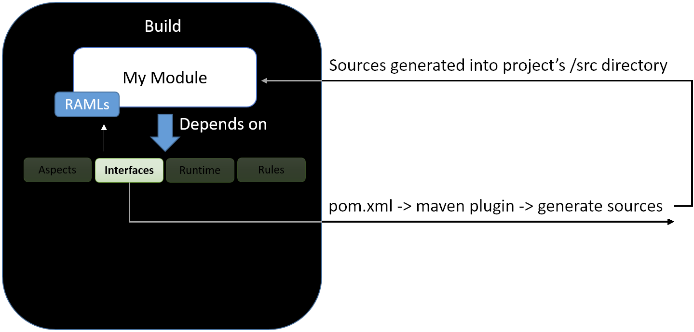

# Raml-Module-Builder

Copyright (C) 2017 The Open Library Foundation

This software is distributed under the terms of the Apache License, Version 2.0. See the file ["LICENSE"](https://github.com/folio-org/raml-module-builder/blob/master/LICENSE) for more information.


## Introduction

This documentation includes information about the Raml-Module-Builder (RMB) framework
and examples of how to use it.

The goal of the project is to abstract away as much boilerplate functionality as
possible and allow a developer to focus on implementing business functions. In
other words: **simplify the process of developing a micro service module**.
The framework is RAML driven, meaning a developer / analyst declares APIs that the
'to be developed' module is to expose (via RAML files) and declares the objects
to be used and exposed by the APIs (via JSON schemas). Once the schemas and RAML
files are in place, the framework generates code and offers a number of tools
to help implement the module.
Note that this framework is both a build and a run-time library.


The framework consists of a number of tools:

- domain-models-api-interfaces -- project exposes tools that receive as input
  these RAML files and these JSON schemas, and generates java POJOs and java
  interfaces.

- domain-models-api-aspects -- project exposes tools that enforce strict
  adherence to the RAML declaration to any API call by exposing validation
  functionality.

    - for example: a RAML file may indicate that a specific parameter is
      mandatory or that a query parameter value must be a specific regex pattern.
      The aspects project handles this type of validation for developers so that it
      does not need to be re-developed over and over. More on validation
      [below](https://github.com/folio-org/raml-module-builder#a-little-more-on-validation).

- domain-models-runtime -- project exposes a run-time library which should be
  used to run a module. It is Vert.x based. When a developer implements the
  interfaces generated by the interfaces project, the run-time library should be
  included in the developed project and run. The run-time library will
  automatically map URLs to the correct implemented function so that developers
  only need to implement APIs, and so all the wiring, validation,
  parameter / header / body parsing, logging (every request is logged in an
  apache like format) is handled by the framework. Its goal is to abstract
  away all boilerplate functionality and allow a module implementation to focus
  on implementing business functions.

    - The runtime framework also exposes hooks that allow developers to
      implement one-time jobs, scheduled tasks, etc.

    - Provides tooling (Postgres client, etc.) for developers
      to use while developing their module.

    - Runtime library runs a Vert.x verticle.

- rules -- Basic Drools functionality allowing module developers to create
  validation rules via .drl files for objects (JSON schemas).

## Overview

Follow the [Introduction](#introduction) section above to generally understand
the RMB framework.
Review the separate [Okapi Guide and Reference](https://github.com/folio-org/okapi/blob/master/doc/guide.md).
Scan the [Basics](#the-basics) section below for a high-level overview of RMB. Then follow the
[Get started with a sample working module](#get-started-with-a-sample-working-module)
section which demonstrates an already constructed example.
When that is understood, then move on to the section
[Creating a new module](#creating-a-new-module) to get your project started.

Note that actually building this RAML Module Builder framework is not required.
(Some of the images below are out-of-date.) The already published artifacts will
be [incorporated](#step-2-include-the-jars-in-your-project-pomxml) into your project from the repository.

## The basics





### Implement the interfaces

For example, note the validation annotations generated based on the constraints in the RAML.


- When implementing the interfaces, you must add the @Validate
  annotation to enforce the annotated constraints declared by the interface.

- Note that a Bib entity was passed as a parameter. The runtime framework
  transforms the JSON passed in the body into the correct POJO.


### Set up your pom.xml

- Add the `exec-maven-plugin`. This will generate the POJOs and interfaces based on
  the RAML files.

- Add the `aspectj-maven-plugin`. This is required if you
  would like the runtime framework to validate all URLs.

- Add the `maven-shade-plugin`, indicating the main class to
  run as `RestLauncher` and main verticle as `RestVerticle`. This will create a
  runnable jar with the runtime's `RestVerticle` serving as the main class.

- Add the `maven-resources-plugin`. This will copy
  your RAML files to the /apidocs directory where they will be made visible
  online (html view) by the runtime framework.

These are further explained below.

### Build and run

Do `mvn clean install` ... and run :)

The runtime framework will route URLs in your RAML to the correct method
implementation. It will validate (if `@Validate` was used), log, and expose
various tools.

Notice that no web server was configured or even referenced in the implementing
module - this is all handled by the runtime framework.

Some sample projects:

- https://github.com/folio-org/mod-configuration
- https://github.com/folio-org/mod-loan-storage
- https://github.com/folio-org/mod-acquisitions-postgres

and other [modules](http://dev.folio.org/source-code/#server-side) (not all do use the RMB).


## Get started with a sample working module

The [mod-configuration](https://github.com/folio-org/mod-configuration)
is a full example which uses the RMB. Clone it, and then investigate:

```
$ git clone --recursive https://github.com/folio-org/mod-configuration.git
$ cd mod-configuration
$ mvn clean install
```

- This module implements basic configuration APIs. It contains two sub modules, the configuration server and a configuration client (which can be used to interact with the server in a more OO manner, instead of using URLs).

- Its RAMLs and JSON schemas can be found in the `ramls` directory.
These are also displayed as local [API documentation](#documentation-of-the-apis).

- Open the pom.xml in the configuration server module - notice the jars in the `dependencies` section as well as the `plugins` section. The `ramls` directory is declared in the pom.xml and passed to the interface and POJO generating tool via a maven exec plugin. The tool generates source files within the configuration server project. The generated interfaces are implemented within the project in the `org.folio.rest.impl` package.

- Open the `mod-configuration-server/src/main/java/org/folio/rest/impl/ConfigAPI.java` class. Notice that there is a function representing each endpoint that is declared in the RAML file. The appropriate parameters (as described in the RAML) are passed as parameters to these functions so that no parameter parsing is needed by the developer. Notice that the ConfigAPI.java contains all the code for the entire module. All handling of URLs, validations, objects, etc. is all either in the RMB jars, or generated for the configuration module by the RMB at build time.

- **IMPORTANT NOTE:** Every interface implementation - by any module -
  must reside in package `org.folio.rest.impl`. This is the package that is
  scanned at runtime by the runtime framework, to find the needed runtime
  implementations of the generated interfaces.

Now run the configuration module in standalone mode:

```
$ java -jar mod-configuration-server/target/mod-configuration-server-fat.jar embed_postgres=true
```

Now send some requests using '[curl](https://curl.haxx.se)' or '[httpie](https://httpie.org)'
(for example to view or set the [Logging](#logging) levels).

At this stage there is not much that can be queried, so stop that quick demonstration now.
After explaining general command-line options, etc.
we will get your local development server running and populated with test data.

## Command-line options

- `-Djava.util.logging.config.file=C:\configuration\vertx-default-jul-logging.properties`
  (Optional -- defaults to `target/classes/vertx-default-jul-logging.properties`)

- `-Dhttp.port=8080` (Optional -- defaults to 8081)

- `embed_postgres=true` (Optional -- defaults to false)

- `db_connection=[path]` (Optional -- path to an external JSON config file with
  connection parameters to a PostgreSQL DB)

  - for example Postgres: `{"host":"localhost", "port":5432, "maxPoolSize":50,
    "username":"postgres","password":"mysecretpassword", "database":"postgres",
    "charset":"windows-1252", "queryTimeout" : 10000}`

- `drools_dir=[path]` (Optional -- path to an external drools file. By default,
  `*.drl` files in the `resources/rules` directory are loaded)

- Other module-specific arguments can be passed via the command line in the format key=value. These will be accessible to implementing modules via `RestVerticle.MODULE_SPECIFIC_ARGS` map.

- Optional JVM arguments can be passed before the `-jar` argument, e.g.
`-XX:+HeapDumpOnOutOfMemoryError`
`-XX:+PrintGCDetails`
`-XX:+PrintGCTimeStamps`
`-Xloggc:C:\Git\circulation\gc.log`

## Environment Variables

RMB implementing modules expect a set of environment variables to be passed in at module startup. The environment variables expected by RMB modules are:

 - DB_HOST
 - DB_PORT
 - DB_USERNAME
 - DB_PASSWORD
 - DB_DATABASE
 - DB_QUERYTIMEOUT
 - DB_CHARSET
 - DB_MAXPOOLSIZE

See the [Environment Variables](https://github.com/folio-org/okapi/blob/master/doc/guide.md#environment-variables) section of the Okapi Guide for more information on how to deploy environment variables to RMB modules via Okapi.

## Local development server

To get going quickly with running a local instance of Okapi, adding a tenant and some test data,
and deploying some modules, follow these separate brief
[instructions](https://github.com/folio-org/ui-okapi-console/blob/master/automation/README.md).

Ensure that the sample users are loaded, and that a query is successful:

```
curl -D - -w '\n' \
  -H "X-Okapi-Tenant: diku" \
  http://localhost:9131/users?active=true
```

Use the local [API documentation](#documentation-of-the-apis) to view the RAMLs and conduct some more requests
(and remember to specify the "X-Okapi-Tenant: diku" header):
```
http://localhost:9131/apidocs/index.html?raml=raml/users.raml
```

Now use a similar method to deploy and enable the mod-configuration module that we started to investigate
[above](#get-started-with-a-sample-working-module).

Use the local [API documentation](#documentation-of-the-apis) to view the RAMLs, and post some entries,
and conduct some requests:
```
http://localhost:9132/apidocs/index.html?raml=raml/configuration/config.raml
```

Continue to investigate the mod-configuration example.

After getting started with your new module as explained below, it can be similarly deployed and investigated.

## Creating a new module

### Step 1: Describe the APIs to be exposed by the new module

Create the new project using the normal layout of files and basic POM file.

Add an area for the RAML, schemas, and examples files, e.g. `/ramls`.
These define the API endpoints.
Get started by using the following familiar example:

`ebook.raml`

```raml
#%RAML 0.8

title: e-BookMobile API
baseUri: http://api.e-bookmobile.com/{version}
version: v1

schemas:
  - book: !include ebook.json

/ebooks:
  /{bookTitle}:
    get:
      queryParameters:
        author:
          displayName: Author
          type: string
          description: An author's full name
          example: Mary Roach
          required: false
        publicationYear:
          displayName: Pub Year
          type: number
          description: The year released for the first time in the US
          example: 1984
          required: false
        rating:
          displayName: Rating
          type: number
          description: Average rating (1-5) submitted by users
          example: 3.14
          required: false
        isbn:
          displayName: ISBN
          type: string
          minLength: 10
          example: 03217360797
      responses:
        200:
          body:
            application/json:
              schema: book
              example: |
                {
                  "bookdata": {
                    "id": "SbBGk",
                    "title": "Stiff: The Curious Lives of Human Cadavers",
                    "description": null,
                    "datetime": 1341533193,
                    "genre": "science",
                    "author": "Mary Roach",
                    "link": "http://e-bookmobile.com/books/Stiff"
                  },
                  "success": true,
                  "status": 200
                }
    put:
      queryParameters:
        access_token:
          displayName: Access Token
          type: string
          description: "Token giving you permission to make call"
          required: true
```

Create JSON schemas indicating the objects exposed by the module:

`ebook.json`

```json
{
  "$schema": "http://json-schema.org/draft-04/schema#",
  "type": "object",
  "properties": {
    "bookdata": {
      "type": "object",
      "properties": {
        "id": {
          "type": "string"
        },
        "title": {
          "type": "string"
        },
        "description": {
          "type": "null"
        },
        "datetime": {
          "type": "integer"
        },
        "genre": {
          "type": "string"
        },
        "author": {
          "type": "string"
        },
        "link": {
          "type": "string"
        }
      },
      "required": [
        "id",
        "title",
        "description",
        "datetime",
        "genre",
        "author",
        "link"
      ]
    },
    "success": {
      "type": "boolean"
    },
    "status": {
      "type": "integer"
    }
  },
  "required": [
    "bookdata",
    "success",
    "status"
  ]
}
```

### Step 2: Include the jars in your project pom.xml

```xml
  <repositories>
    <repository>
      <id>folio-nexus</id>
      <name>FOLIO Maven repository</name>
      <url>https://repository.folio.org/repository/maven-folio</url>
    </repository>
  </repositories>
  <dependencies>
    <dependency>
      <groupId>org.folio</groupId>
      <artifactId>domain-models-runtime</artifactId>
      <version>10.0.4-SNAPSHOT</version>
    </dependency>
  </dependencies>
```

### Step 3: Add the plugins to your pom.xml

Four plugins need to be declared in the POM file:

- The `exec-maven-plugin` which will generate the POJOs and interfaces based on
  the RAML files.

- The `aspectj-maven-plugin` which will pre-compile your code with validation aspects
  provided by the framework - remember the `@Validate` annotation. The
  validation supplied by the framework verifies that headers are passed
  correctly, parameters are of the correct type and contain the correct content
  as indicated by the RAML file.

- The `maven-shade-plugin` which will generate a fat-jar runnable jar. While the
  shade plugin is not mandatory, it does makes things easier. The important thing to
  notice is the main class that will be run when running your module. Notice the
  `Main-class` and `Main-Verticle` in the shade plugin configuration.

- The `maven-resources-plugin`, which will copy the RAML files into a directory
  under `/apidocs` so that the runtime framework can pick it up and display html
  documentation based on the RAML files.

Add `ramlfiles_path` properties indicating the location of the RAML directories:

```xml
  <properties>
    <ramlfiles_path>${basedir}/ramls</ramlfiles_path>
    <ramlfiles_util_path>${basedir}/raml-util</ramlfiles_util_path>
  </properties>
```

Add the plugins:

```xml
      <plugin>
        <groupId>org.apache.maven.plugins</groupId>
        <artifactId>maven-compiler-plugin</artifactId>
        <version>3.1</version>
        <configuration>
          <source>1.8</source>
          <target>1.8</target>
          <encoding>UTF-8</encoding>
        </configuration>
      </plugin>

      <plugin>
        <groupId>org.codehaus.mojo</groupId>
        <artifactId>exec-maven-plugin</artifactId>
        <version>1.5.0</version>
        <executions>
          <execution>
            <id>generate_interfaces</id>
            <phase>generate-sources</phase>
            <goals>
              <goal>java</goal>
            </goals>
            <configuration>
              <mainClass>org.folio.rest.tools.GenerateRunner</mainClass>
              <!-- <executable>java</executable> -->
              <cleanupDaemonThreads>false</cleanupDaemonThreads>
              <systemProperties>
                <systemProperty>
                  <key>project.basedir</key>
                  <value>${basedir}</value>
                </systemProperty>
                <systemProperty>
                  <key>raml_files</key>
                  <value>${ramlfiles_path}</value>
                </systemProperty>
              </systemProperties>
            </configuration>
          </execution>
        </executions>
      </plugin>

      <plugin>
        <groupId>org.codehaus.mojo</groupId>
        <artifactId>aspectj-maven-plugin</artifactId>
        <version>1.9</version>
        <configuration>
          <verbose>true</verbose>
          <showWeaveInfo>false</showWeaveInfo>
          <complianceLevel>1.8</complianceLevel>
          <includes>
            <include>**/impl/*.java</include>
            <include>**/*.aj</include>
          </includes>
          <aspectDirectory>src/main/java/org/folio/rest/annotations</aspectDirectory>
          <XaddSerialVersionUID>true</XaddSerialVersionUID>
          <showWeaveInfo>true</showWeaveInfo>
          <aspectLibraries>
            <aspectLibrary>
              <groupId>org.folio</groupId>
              <artifactId>domain-models-api-aspects</artifactId>
            </aspectLibrary>
          </aspectLibraries>
        </configuration>
        <executions>
          <execution>
            <goals>
              <goal>compile</goal>
            </goals>
          </execution>
        </executions>
        <dependencies>
          <dependency>
            <groupId>org.aspectj</groupId>
            <artifactId>aspectjrt</artifactId>
            <version>1.8.9</version>
          </dependency>
          <dependency>
            <groupId>org.aspectj</groupId>
            <artifactId>aspectjtools</artifactId>
            <version>1.8.9</version>
          </dependency>
        </dependencies>
      </plugin>
      <plugin>
        <groupId>org.apache.maven.plugins</groupId>
        <artifactId>maven-resources-plugin</artifactId>
        <version>3.0.1</version>
        <executions>
          <execution>
            <id>copy-resources</id>
            <phase>prepare-package</phase>
            <goals>
              <goal>copy-resources</goal>
            </goals>
            <configuration>
              <outputDirectory>${basedir}/target/classes/apidocs/raml</outputDirectory>
              <resources>
                <resource>
                  <directory>${ramlfiles_path}</directory>
                  <filtering>true</filtering>
                </resource>
              </resources>
            </configuration>
          </execution>
          <execution>
            <id>copy-resources-2</id>
            <phase>prepare-package</phase>
            <goals>
              <goal>copy-resources</goal>
            </goals>
            <configuration>
              <outputDirectory>${basedir}/target/classes/apidocs/raml-util</outputDirectory>
              <resources>
                <resource>
                  <directory>${ramlfiles_util_path}</directory>
                  <filtering>true</filtering>
                </resource>
              </resources>
            </configuration>
          </execution>
        </executions>
      </plugin>

      <!-- Replace the baseUri and the protocols in the RAMLs that have been copied to
        apidocs directory so that they can be used via the local html api console. -->
      <plugin>
        <groupId>org.apache.maven.plugins</groupId>
        <artifactId>maven-antrun-plugin</artifactId>
        <version>1.8</version>
        <executions>
          <execution>
            <phase>prepare-package</phase>
            <configuration>
              <target>
                <replace token="baseUri: http://github.com/org/folio/mod-place-storage"
                  value="baseUri: http://localhost:{http.port}"
                  dir="${basedir}/target/classes/apidocs/raml">
                  <include name="**/*.raml" />
                </replace>
                <replace token="protocols: [ HTTPS ]" value="protocols: [ HTTP ]"
                  dir="${basedir}/target/classes/apidocs/raml">
                  <include name="**/*.raml" />
                </replace>
              </target>
            </configuration>
            <goals>
              <goal>run</goal>
            </goals>
          </execution>
        </executions>
      </plugin>

      <plugin>
        <groupId>org.apache.maven.plugins</groupId>
        <artifactId>maven-shade-plugin</artifactId>
        <version>2.4</version>
        <executions>
          <execution>
            <phase>package</phase>
            <goals>
              <goal>shade</goal>
            </goals>
            <configuration>
              <transformers>
                <transformer
                  implementation="org.apache.maven.plugins.shade.resource.ManifestResourceTransformer">
                  <manifestEntries>
                    <Main-Class>org.folio.rest.RestLauncher</Main-Class>
                    <Main-Verticle>org.folio.rest.RestVerticle</Main-Verticle>
                  </manifestEntries>
                </transformer>
              </transformers>
              <artifactSet />
              <outputFile>${project.build.directory}/${project.artifactId}-fat.jar</outputFile>
            </configuration>
          </execution>
        </executions>
      </plugin>
```

Compare the POM with other FOLIO RMB-based modules.

### Step 4: Build your project

Do `mvn clean install`

This should:

- Create java interfaces for each added RAML file.

- Each interface will contain functions to be implemented (each function represents
  an API endpoint declared in the RAML).

- The parameters within each function interface will be annotated with
  validation annotations that were declared in the RAML. So, if a trait was
  marked as mandatory, it will be marked as @NOT_NULL. This is not something that
  needs to be handled by the implementer. This is handled by the framework,
  which handles validation.

- POJOs -- The JSON schemas will be generated into java objects.

- All generated code can be found in the `org.folio.rest.jaxrs` package.

### Step 5: Implement the generated interfaces

Implement the interfaces associated with the RAML files you created. An
interface is generated for every root endpoint in the RAML files.
So, for the ebook RAML an
`org.folio.rest.jaxrs.resource.EbooksResource` interface will be generated.
Note that the `org.folio.rest.jaxrs.resource` will be the package for every
generated interface.

See an [example](#function-example) of an implemented function.

### Step 6: Design the RAML files

It is beneficial at this stage to take some time to design and prepare the RAML files for the project.
Investigate the other FOLIO modules for guidance.

Add the shared suite of [RAML utility](http://dev.folio.org/source-code/#server-side) files:
```
git submodule add https://github.com/folio-org/raml raml-util
```

The RMB does do some validation of RAML files at compile-time.
There are some useful tools to assist with command-line validation and some
can be integrated with text editors, e.g.
[raml-cop](https://github.com/thebinarypenguin/raml-cop).

Remember that the POM configuration enables viewing your RAML and interacting
with your application via the local [API documentation](#documentation-of-the-apis).

NOTE: The FOLIO project is currently using `RAML 0.8` version until the
`RAML 1.0` tools have [settled](https://issues.folio.org/browse/FOLIO-523).

## Adding an init() implementation

It is possible to add custom code that will run once before the application is deployed
(e.g. to init a DB, create a cache, create static variables, etc.) by implementing
the `InitAPIs` interface. You must implement the
`init(Vertx vertx, Context context, Handler<AsyncResult<Boolean>> resultHandler)`. Only one implementation per module is supported.
Currently the implementation should sit in the
`org.folio.rest.impl` package in the implementing project. The implementation
will run during verticle deployment. The verticle will not complete deployment
until the init() completes. The init() function can do anything basically, but
it must call back the Handler. For example:

```java
public class InitAPIs implements InitAPI {

  public void init(Vertx vertx, Context context, Handler<AsyncResult<Boolean>> resultHandler){
    try {
      sayHello();
      resultHandler.handle(io.vertx.core.Future.succeededFuture(true));
    } catch (Exception e) {
      e.printStackTrace();
      resultHandler.handle(io.vertx.core.Future.failedFuture(e.getMessage()));
    }
  }
}
```


## Adding code to run periodically

It is possible to add custom code that will run periodically. For example,
to ongoingly check status of something in the system and act upon that.
Need to implement the PeriodicAPI interface:

```java
public interface PeriodicAPI {
  /** this implementation should return the delay in which to run the function */
  public long runEvery();
  /** this is the implementation that will be run every runEvery() milliseconds*/
  public void run(Vertx vertx, Context context);

}
```

For example:

```java
public class PeriodicAPIImpl implements PeriodicAPI {


  @Override
  public long runEvery() {
    return 45000;
  }

  @Override
  public void run(Vertx vertx, Context context) {
    try {
      InitAPIs.amIMaster(vertx, context, v-> {
        if(v.failed()){
          //TODO - what should be done here?
        }
      });
    } catch (Exception e) {
      e.printStackTrace();
    }
  }
```

There can be multiple implementations of the periodic hook, all will be called by the RMB framework.


## Adding a hook to run immediately after verticle deployment

It is possible to add custom code that will be run immediately after the verticle running the module is deployed.

```java
public interface PostDeployVerticle {

  /** this implementation will be run immediately after the verticle is initially deployed. Failure does not stop
   * deployment success. The implementing function MUST call the resultHandler to pass back
   * control to the verticle, like so: resultHandler.handle(io.vertx.core.Future.succeededFuture(true));
   * if not, this function will hang the verticle during deployment */
  public void init(Vertx vertx, Context context, Handler<AsyncResult<Boolean>> resultHandler);

}
```

An implementation example:

```java
public class InitConfigService implements PostDeployVerticle {

  @Override
  public void init(Vertx vertx, Context context, Handler<AsyncResult<Boolean>> handler) {

    System.out.println("Getting secret key to decode DB password.");
    /** hard code the secret key for now - in production env - change this to read from a secure place */
    String secretKey = "b2%2BS%2BX4F/NFys/0jMaEG1A";
    int port = context.config().getInteger("http.port");
    AdminClient ac = new AdminClient("localhost", port, null);
    ac.postSetAESKey(secretKey, reply -> {
      if(reply.statusCode() == 204){
        handler.handle(io.vertx.core.Future.succeededFuture(true));
      }
      else{
        handler.handle(io.vertx.core.Future.failedFuture(reply.statusCode() + ", " + reply.statusMessage()));
      }
    });
  }

}
```

## Adding a shutdown hook

It is possible to add custom code that will run just before the verticle is
undeployed and the JVM stopped. This will occur on graceful shutdowns, but can
not be guaranteed to run if the JVM is forcefully shutdown.

The interface to implement:

```java
public interface ShutdownAPI {

  public void shutdown(Vertx vertx, Context context, Handler<AsyncResult<Void>> handler);

}
```

An implementation example:

```java
public class ShutdownImpl implements ShutdownAPI {

  @Override
  public void shutdown(Vertx vertx, Context context, Handler<AsyncResult<Void>> handler) {
    try {
      AuditLogger.getInstance().publish(new LogRecord(Level.INFO, "closing audit logger"));
      AuditLogger.getInstance().close();
      handler.handle(io.vertx.core.Future.succeededFuture());
    }
    catch (Exception e) {
      e.printStackTrace();
      handler.handle(io.vertx.core.Future.failedFuture(e.getMessage()));
    }
  }
}
```


Note that when implementing the generated interfaces it is possible to add a constructor to the implementing class. This constructor will be called for every API call. This is another way you can implement custom code that will run per request.


## Implementing file uploads

The RMB (RAML-Module-Builder) supports several methods to upload files and data. The implementing module can use the `multipart/form-data` header or the `application/octet-stream` header to indicate that the HTTP request is an upload content request.

### Option 1

#### A multipart RAML declaration may look something like this:

```raml
/uploadmultipart:
    description: Uploads a file
    post:
      description: |
          Uploads a file
      body:
        multipart/form-data:
          formParameters:
            file:
              description: The file to be uploaded
              required: true
              type: file
```

The body content would look something like this:

```sh
------WebKitFormBoundaryNKJKWHABrxY1AdmG
Content-Disposition: form-data; name="config.json"; filename="kv_configuration.sample"
Content-Type: application/octet-stream

<file content 1>

------WebKitFormBoundaryNKJKWHABrxY1AdmG
Content-Disposition: form-data; name="sample.drl"; filename="Sample.drl"
Content-Type: application/octet-stream

<file content 2>

------WebKitFormBoundaryNKJKWHABrxY1AdmG
```

There will be a `MimeMultipart` parameter passed into the generated interfaces. An implementing
module can access its content in the following manner:

```sh
int parts = entity.getCount();
for (int i = 0; i < parts; i++) {
        BodyPart part = entity.getBodyPart(i);
        Object o = part.getContent();
}
```

where each section in the body (separated by the boundary) is a "part".

#### An octet/stream can look something like this:

```raml
 /uploadOctet:
    description: Uploads a file
    post:
      description: |
          Uploads a file
      body:
        application/octet-stream:
```

The interfaces generated from the above will contain a parameter of type `java.io.InputStream`
representing the uploaded file.


### Option 2

The RMB allows for content to be streamed to a specific implemented interface.
For example, to upload a large file without having to save it all in memory:

 - Mark the function to handle the upload with the `org.folio.rest.annotations.Stream` annotation `@Stream`.
 - Declare the RAML as receiving `application/octet-stream` (see Option 1 above)

The RMB will then call the function every time a chunk of data is received. This means that a new Object is
instantiated by the RMB for each chunk of data, and the function of that object is called with the partial data included in a `java.io.InputStream` object.


## PostgreSQL integration

By default an embedded PostgreSQL is included in the runtime, but is not run by
default. To change that add `embed_postgres=true` to the command line
(`java -jar mod-configuration-server-fat.jar embed_postgres=true`).
Connection parameters to a non-embedded PostgreSQL can be placed in `resources/postgres-conf.json` or passed via the command line.

The runtime framework exposes a PostgreSQL async client which offers CRUD
operations in an ORM type fashion.
https://github.com/folio-org/raml-module-builder/blob/master/domain-models-runtime/src/main/java/org/folio/rest/persist/PostgresClient.java

**Important Note:** The PostgreSQL client currently implemented assumes
JSONB tables in PostgreSQL. This is not mandatory and developers can work with
regular PostgreSQL tables but will need to implement their own data access
layer.

Currently the expected format is:

```sql
create table <schema>.<table_name> (
  _id SERIAL PRIMARY KEY,
  jsonb JSONB NOT NULL
);
```

This means that all the fields in the JSON schema (representing the JSON object) **are** the "jsonb" (column) in the Postgres table.

There is one exception to this. Lets take an example of an auditing table which wants to store changes to a specific table. Every row in the audit table will contain the operation, date, and the current content (jsonb) in the table being audited.

For example:


_id| orig_id | operation | jsonb | creation_date
------------ | -------------  | -------------  | -------------  | -------------  |
 |  |
12345| 11111 | insert | {json with current data} | 1/1/2010
67890| 22222 | delete | {json with previous data} | 1/1/2010
12321| 11111 | update | {json with current data} | 1/1/2010

When querying such a table, you would want to get back all columns, not just the id and the jsonb columns.

To achieve this, the declared JSON schema would need to contain a "jsonb" field.
For example: JSON schema representing the entire auditing table row:

```json
{
  "$schema":"http://json-schema.org/draft-04/schema#",
  "type":"object",
  "properties":{
    "_id":{
      "type":"string"
    },
    "orig_id":{
      "type":"string"
    },
    "operation":{
      "type":"string"
    },
    "jsonb":{
      "type": "object",
        "properties": {
          "content": {
            "id": "contentData",
            "type": "array",
            "items": {
              "type": "object",
              "$ref" : "config"
          }
        }
      }
    },
    "creation_date":{
      "type":"string"
    }
  }
}
```
where the "jsonb" field references a JSON schema that will exist in the "jsonb" column in the table.

The example above refers to querying only. As of now, saving a record will only save the "jsonb" and "id" fields (the above example uses triggers to populate the operation, creation data, and original id).

#### Credentials

When running in embedded mode, credentials are read from `resources/postgres-conf.json`. If a file is not found, then the following configuration will be used by default:

```
port: 6000
host: 127.0.0.1
username: username
password: password
database: postgres
```

### Securing DB Configuration file

As previously mentioned, the Postgres Client supplied by the RMB looks for a file called `postgres-conf.json`. However, leaving a file which contains the DB password to a superuser in plain text on the server is not a good idea. It is possible to encrypt the password in the file. The encryption should be an AES encryption (symmetric block cipher). This encryption is done with a secret key.

Meaning: password in plain text + secret key = encrypted password

The RMB comes with an AES class that supports generating secret keys, encrypting and decrypting them, https://github.com/folio-org/raml-module-builder/blob/master/domain-models-runtime/src/main/java/org/folio/rest/security/AES.java

Note that the use of this class is optional.

To work with an encrypted password the RMB exposes an API that can be used to set the secret key (stored only in memory). When creating the DB connection the RMB will check to see if the secret key has been set. If the secret key has been set, the RMB will decrypt the password with the secret key, and use the decrypted password to connect to the DB. Otherwise it will assume an un-encrypted password, and will connect using that password as-is.
A module can also set the secret key via the static method `AES.setSecretKey(mykey)`

The needed steps are:

 -  Generate a key
 -  Encrypt a password
 -  Include that password in the config file
 -  Either call `AES.setSecretKey(mykey)` or the `admin/set_AES_key` API (to load the secret key into memory)

A good way for a module to set the secret key is by using the post deployment hook interface in the RMB.

```java
public class InitConfigService implements PostDeployVerticle {
  @Override
  public void init(Vertx vertx, Context context, Handler<AsyncResult<Boolean>> handler) {
    System.out.println("Getting secret key to decode DB password.");
    //** hard code the secret key  - in production env - read from a secure place *//
    String secretKey = "b2%2BS%2BX4F/NFys/0jMaEG1A";
    int port = context.config().getInteger("http.port");
    AdminClient ac = new AdminClient("localhost", port, null);
    ac.postSetAESKey(secretKey, reply -> {
      if(reply.statusCode() == 204){
        handler.handle(io.vertx.core.Future.succeededFuture(true));
      }
      else{
        handler.handle(io.vertx.core.Future.failedFuture(reply.statusCode() + ", " + reply.statusMessage()));
      }
    });
    handler.handle(io.vertx.core.Future.succeededFuture(true));
  }
}
```


## Tenant API

The Postgres Client support in the RMB is schema specific, meaning that it expects every tenant to be represented by its own schema. The RMB exposes three APIs to facilitate the creation of schemas per tenant (a type of provisioning for the tenant). Post, Delete, and 'check existence' of a tenant schema. Note that the use of this API is optional.

The RAML defining the API:

https://github.com/folio-org/raml-module-builder/blob/master/domain-models-runtime/src/main/resources/raml/tenant.raml

#### The Post Tenant API will look for a file in the module's classpath called:
**template_create_tenant.sql**

An example of such a file can be found in the configuration module:

https://github.com/folio-org/mod-configuration/blob/master/mod-configuration-server/src/main/resources/template_create_tenant.sql

Notice the *myuniversity* placeholders in the file. The x-okapi-tenant header passed in to the API call will be used to get the tenant id. That tenant id will replace the *myuniversity* placeholder. The *mymodule* placeholder may be used as well, and is replaced by the name of the module (the value used for the module name is the artifactId found in the pom.xml and the parent artifactId is used if one is found).  Additional placeholders may be added in the future.

Posting a new tenant can optionally include a body. The body should contain a JSON conforming to the https://github.com/folio-org/raml/blob/master/schemas/moduleInfo.schema schema. The `module_to` entry is mandatory if a body is included in the request, indicating the version module for this tenant. The `module_from` entry is optional and indicates an upgrade for the tenant to a new module version. In the case where `module_from` is included in the JSON, the RMB will look for an `template_update_tenant.sql` file to run (if one is not found, then no script will be run. An optional `template_update_audit.sql` can also be created, and it will be run, if found, in case of an update indication [`module_from`])

##### Encrypting Tenant passwords

As of now (this may change in the future), securing a tenant's connection to the database via an encrypted password can be accomplished in the following way:

 - Set the secret key (as described in the Securing DB Configuration file section)
 - When creating a user / role for the tenant in your .sql file include the following:
   - `CREATE USER myuniversity WITH ENCRYPTED PASSWORD 'myuniversity';`

  *myuniversity* PASSWORD will be replaced with the following:
  encrypt(tenant id with secrey key) = **new tenant's password**
  The **new tenant's password** will replace the *myuniversity* PASSWORD value
  The RMB Postrges client will use the secret key and the passed in tenant id to calculate the tenant's password when DB connections are needed for that tenant. Note that if you use the tenant API and set the secret key - the decrypting of the password will be done by the Postgres Client for each tenant connection.


It is also possible to create a **template_audit.sql** file. If the Post tenant API finds this file in the classpath, it will be run as well.

Example file:
https://github.com/folio-org/mod-configuration/blob/master/mod-configuration-server/src/main/resources/template_audit.sql

The RMB comes with a TenantClient to facilitate calling the API via URL.
To post a tenant via the client:

```java
TenantClient tClient = null;
tClient = new TenantClient("localhost", port, "mytenantid");
tClient.post( response -> {
  response.bodyHandler( body -> {
    System.out.println(body.toString());
    async.complete();
  });
});
```

#### The Delete Tenant API will look for a file in the module's classpath called:
**template_delete_tenant.sql**

An example of such a file can be found in the configuration module:

https://github.com/folio-org/mod-configuration/blob/master/mod-configuration-server/src/main/resources/template_delete_tenant.sql


**Some Postgres Client examples**


Examples:

Saving a POJO within a transaction:

```java
PoLine poline = new PoLine();

...

postgresClient.save(beginTx, TABLE_NAME_POLINE, poline , reply -> {...
```

Querying for similar POJOs in the DB (with or without additional criteria):

```java
Criterion c = new Criterion(new Criteria().addField("_id").setJSONB(false).setOperation("=").setValue("'"+entryId+"'"));

postgresClient.get(TABLE_NAME_POLINE, PoLine.class, c,
              reply -> {...
```


## Query Syntax

The RMB can receive parameters of different types. Modules can declare a query parameter and receive it as a string parameter in the generated API functions.

The RMB exposes an easy way to query, using CQL (https://github.com/folio-org/cql2pgjson-java). This enables a seamless integration from the query parameters to a prepared "where" clause to query with.

```java
//create object on table.field
CQL2PgJSON cql2pgJson = new CQL2PgJSON("tablename.jsonb");
//cql wrapper based on table.field and the cql query
CQLWrapper cql = new CQLWrapper(cql2pgJson, query);
//query the db with the cql wrapper object
PostgresClient.getInstance(context.owner(), tenantId).get(CONFIG_COLLECTION, Config.class,
          cql, true,
```

The CQLWrapper can also get an offset and limit:

```java
new CQLWrapper(cql2pgJson, query).setLimit(new Limit(limit)).setOffset(new Offset(offset));
```

A CQL querying example:

```sh
http://localhost:<port>/configurations/entries?query=scope.institution_id=aaa%20sortBy%20enabled
```

## Drools integration

The RMB framework automatically scans the `/resources/rules` path in an implemented project for
`*.drl` files. A directory can also be passed via the command line `drools_dir`. The rule files are loaded and are applied automatically to all objects passed in the body (post,
put) by the runtime framework. This works in the following manner:
 - a POST / PUT request comes in with a body
 - The body for the request is mapped to a generated Pojo
 - The Pojo is inserted into the RMB's Drools session
 - All rules are run against the Pojo

This allows for more complex validation of objects.

- For example, two specific fields can logically be null, but not at the
  same time. That can easily be implemented with a Drool, as those types of
  validations are harder to create in a RAML file.

- The `rules` project also exposes the drools session and allows validation
  within the implemented APIs. See the `tests` in the `rules` project.

For example: (Sample.drl)

```
package com.sample

import org.folio.rest.jaxrs.model.Patron;

rule "Patron needs one ID at the least"

    no-loop

    when
        p : Patron( patronBarcode  == null, patronLocalId == null )
    then
        throw new java.lang.Exception("Patron needs one ID field populated at the least");
end
```

It is also possible to create a Drools session in your code, and load rules into the session in a more dynamic way.
For example:

```java
import org.folio.rulez.Rules;
...
List<String> ruleList = generateDummyRule();
Rules rules = new Rules(ruleList);
ksession = rules.buildSession();
...
Messages message = new Messages();
ksession.insert(message);
ksession.fireAllRules();
Assert.assertEquals("THIS IS A TEST", message.getMessage());
```

An additional option to use the Drools framework in the RMB is to load rules dynamically. For example, a module may decide to store Drool `.drl` files in a database. This enables a module to allow admin users to update rules in the database and then load them into the RMB validation mechanism for use at runtime.

```java
      Rules rules = new Rules(List<String> rulesLoaded);
      ksession = rules.buildSession();
      RestVerticle.updateDroolsSession(ksession);
```

## Messages

The runtime framework comes with a set of messages it prints out to the logs /
sends back as error responses to incorrect API calls. These messages are
language-specific. In order to add your own message files, place the files in
your project under the `/resources/messages` directory.

Note that the format of the file names should be either:
- `[name]_[lang_2_letters].properties` (e.g.: `APIMessages_de.properties`)
- `[lang_2_letters]_messages.prop` (e.g.: `en_messages.prop`)

For example:
In the circulation project, the messages file can be found at `/circulation/src/main/resources/en_messages.prop` with the following content:

```sh
20002=Operation can not be calculated on a Null Amount
20003=Unable to pay fine, amount is larger than owed
20004=The item {0} is not renewable
20005=Loan period must be greater than 1, period entered: {0}
```

The circulation project exposes these messages as enums for easier usage in the code:

```java
package org.folio.utils;

import org.folio.rest.tools.messages.MessageEnum;

public enum CircMessageConsts implements MessageEnum {

  OperationOnNullAmount("20002"),
  FinePaidTooMuch("20003"),
  NonRenewable("20004"),
  LoanPeriodError("20005");

  private String code;
  private CircMessageConsts(String code){
    this.code = code;
  }
  public String getCode(){
    return code;
  }
}
```

Usage:

`private final Messages messages = Messages.getInstance();`

`messages.getMessage(lang, CircMessageConsts.OperationOnNullAmount);`

Note: parameters can also be passed when relevant. The raml-module-builder runtime also exposes generic error message enums which can be found at `/domain-models-runtime/src/main/java/org/folio/rest/tools/messages/MessageConsts.java`

## Documentation of the APIs

The runtime framework includes a web application which exposes RAMLs in a
view-friendly HTML format. The `maven-resources-plugin` plugin described earlier
copies the RAML files into the correct directory in your project, so that the
runtime framework can access it and show local API documentation.

So for example, when running the [sample working module](#get-started-with-a-sample-working-module)
then its API documentation is at:

```
http://localhost:8081/apidocs/index.html?raml=raml/configuration/config.raml
```

If instead your [new module](#creating-a-new-module) is running on the default port,
then its API documentation is at:

```
http://localhost:8081/apidocs/index.html?raml=raml/ebook.raml
```

The RMB also automatically provides other documentation, such as the "Admin API":

```
http://localhost:8081/apidocs/index.html?raml=raml/admin.raml
```

All current API documentation is also available at [dev.folio.org/doc/api](http://dev.folio.org/doc/api/)

## Logging

As stated earlier in [Command-line options](#command-line-options), a configuration file can be specified with logging configurations. However, log levels can also be changed via the `/admin` API provided by the framework. For example:

Get log level of all classes:

(GET) `http://localhost:8081/admin/loglevel`

Change log level of all classes to FINE:

(PUT) `http://localhost:8081/admin/loglevel?level=FINE`

A `java_package` parameter can also be passed to change the log level of a specific package. For example:

 `http://localhost:8081/admin/loglevel?level=INFO&java_package=org.folio.rest.persist.PostgresClient`

 `http://localhost:8081/admin/loglevel?level=INFO&java_package=org.folio.rest.persist`

## Monitoring

The runtime framework via the `/admin` API exposes (as previously mentioned) some APIs to help monitor the service (setting log levels, DB information).
Some are listed below (and see the [full set](#documentation-of-the-apis)):

 - `/admin/jstack` -- Stack traces of all threads in the JVM to help find slower and bottleneck methods.
 - `/admin/memory` -- A jstat type of reply indicating memory usage within the JVM on a per pool basis (survivor, old gen, new gen, metadata, etc.) with usage percentages.
 - `/admin/slow_queries` -- Queries taking longer than X seconds.
 - `/admin/cache_hit_rates` -- Cache hit rates in Postgres.
 - `/admin/table_index_usage` -- Index usage per table.
 - `/admin/postgres_table_size` -- Disk space used per table.
 - `/admin/postgres_table_access_stats` -- Information about how tables are being accessed.
 - `/admin/postgres_load` -- Load information in Postgres.
 - `/admin/postgres_active_sessions` -- Active sessions in Postgres.
 - `/admin/health` -- Returns status code 200 as long as service is up.
 - `/admin/module_stats` -- Summary statistics (count, sum, min, max, average) of all select / update / delete / insert DB queries in the last 2 minutes.

## Overriding Out of The Box RMB APIs
It is possible to over ride APIs that the RMB provides with custom implementations.
For example:
To override the `/health` API to return a relevant business logic health check for a specific module do the following:

1. `extend` the AdminAPI class that comes with the RMB framework - `public class CustomHealthCheck extends AdminAPI` and over ride the `getAdminHealth` function. The RMB will route the URL endpoint associated with the function to the custom module's implementation.

Example:

```java
public class CustomHealthCheck extends AdminAPI {

  @Override
  public void getAdminHealth(Map<String, String> okapiHeaders,
      Handler<AsyncResult<Response>> asyncResultHandler, Context vertxContext) throws Exception {

    super.getAdminHealth(okapiHeaders,  res -> {
      System.out.println(" --- this is an over ride of the health API by the config module "+res.result().getStatus());
      asyncResultHandler.handle(io.vertx.core.Future.succeededFuture(GetAdminHealthResponse.withOK()));
    }, vertxContext);
  }

  @Override
  public void getAdminModuleStats(Map<String, String> okapiHeaders,
      Handler<AsyncResult<Response>> asyncResultHandler, Context vertxContext) throws Exception {

    super.getAdminModuleStats(okapiHeaders,  res -> {

      JsonObject o = new JsonObject(res.result().getEntity().toString());

      System.out.println(" --- this is an over ride of the Module Stats API by the config module ");
      asyncResultHandler.handle(io.vertx.core.Future.succeededFuture(GetAdminModuleStatsResponse.
        withPlainOK( o.encodePrettily() )));
    }, vertxContext);
  }
}
```

## Client Generator

The framework can generate a Client class for every RAML file with a function for every API endpoint in the RAML.

To generate a client API from your RAML add the following plugin to your pom.xml

```xml
      <plugin>
        <groupId>org.codehaus.mojo</groupId>
        <artifactId>exec-maven-plugin</artifactId>
        <version>1.5.0</version>
        <executions>
          <execution>
            <id>generate_client</id>
            <phase>process-classes</phase>
            <goals>
              <goal>java</goal>
            </goals>
            <configuration>
              <mainClass>org.folio.rest.tools.ClientGenerator</mainClass>
              <cleanupDaemonThreads>false</cleanupDaemonThreads>
              <systemProperties>
                <systemProperty>
                  <key>client.generate</key>
                  <value>true</value>
                </systemProperty>
                <systemProperty>
                  <key>project.basedir</key>
                  <value>${basedir}</value>
                </systemProperty>
                <systemProperty>
                  <key>json.type</key>
                  <value>postgres</value>
                </systemProperty>
              </systemProperties>
            </configuration>
          </execution>
        </executions>
      </plugin>
```

For the monitoring APIs exposed by the runtime framework, changing the log level via the client would look like this:

```java
    AdminClient aClient = new AdminClient("localhost", 8083, "myuniversityId");
    aClient.putLoglevel(Level.FINE, "org.folio",  apiResponse -> {
      System.out.println(apiResponse.statusCode());
    });
```

Requesting a stack trace would look like this:

```java
    AdminClient aClient = new AdminClient("localhost", 8083, "myuniversityId");
    aClient.getJstack( trace -> {
      trace.bodyHandler( content -> {
        System.out.println(content);
      });
    });
```

## A Little More on Validation

Query parameters and header validation


### Object validations


### function example
```java
  @Validate
  @Override
  public void getConfigurationsEntries(String query, int offset, int limit,
      String lang,java.util.Map<String, String>okapiHeaders,
      Handler<AsyncResult<Response>> asyncResultHandler, Context context) throws Exception {

    CQLWrapper cql = getCQL(query,limit, offset);
    /**
    * http://host:port/configurations/entries
    */
    context.runOnContext(v -> {
      try {
        System.out.println("sending... getConfigurationsTables");
        String tenantId = TenantTool.calculateTenantId( okapiHeaders.get(RestVerticle.OKAPI_HEADER_TENANT) );

        PostgresClient.getInstance(context.owner(), tenantId).get(CONFIG_TABLE, Config.class,
          new String[]{"*"}, cql, true,
            reply -> {
              try {
                if(reply.succeeded()){
                  Configs configs = new Configs();
                  List<Config> config = (List<Config>) reply.result()[0];
                  configs.setConfigs(config);
                  configs.setTotalRecords((Integer)reply.result()[1]);
                  asyncResultHandler.handle(io.vertx.core.Future.succeededFuture(GetConfigurationsEntriesResponse.withJsonOK(
                    configs)));
                }
                else{
                  log.error(reply.cause().getMessage(), reply.cause());
                  asyncResultHandler.handle(io.vertx.core.Future.succeededFuture(GetConfigurationsEntriesResponse
                    .withPlainBadRequest(reply.cause().getMessage())));
                }
              } catch (Exception e) {
                log.error(e.getMessage(), e);
                asyncResultHandler.handle(io.vertx.core.Future.succeededFuture(GetConfigurationsEntriesResponse
                  .withPlainInternalServerError(messages.getMessage(
                    lang, MessageConsts.InternalServerError))));
              }
            });
      } catch (Exception e) {
        log.error(e.getMessage(), e);
        String message = messages.getMessage(lang, MessageConsts.InternalServerError);
        if(e.getCause() != null && e.getCause().getClass().getSimpleName().endsWith("CQLParseException")){
          message = " CQL parse error " + e.getLocalizedMessage();
        }
        asyncResultHandler.handle(io.vertx.core.Future.succeededFuture(GetConfigurationsEntriesResponse
          .withPlainInternalServerError(message)));
      }
    });
  }
```

## Some REST examples

Have these in the headers - currently not validated hence not mandatory:

- Accept: application/json,text/plain
- Content-Type: application/json;

### Example 1: Add a fine to a patron (post)

```
http://localhost:8080/patrons/56dbe25ea12958478cec42ba/fines
{
  "fine_amount": 10,
  "fine_outstanding": 0,
  "fine_date": 1413879432,
  "fine_pay_in_full": true,
  "fine_pay_in_partial": false,
  "fine_note": "aaaaaa",
  "item_id": "56dbe160a129584dc8de7973",
  "fine_forgiven": {
 "user": "the cool librarian",
 "amount": "none"
  },
  "patron_id": "56dbe25ea12958478cec42ba"
}
```

### Example 2: Get fines for patron with id

```
http://localhost:8080/patrons/56dbe25ea12958478cec42ba/fines
```

### Example 3: Get a specific patron

```
http://localhost:8080/patrons/56dbe25ea12958478cec42ba
```

### Example 4: Get all patrons

```
http://localhost:8080/patrons
```

### Example 5: Delete a patron (delete)

```
http://localhost:8080/patrons/56dbe791a129584a506fb41a
```

### Example 6: Add a patron (post)

```
http://localhost:8080/patrons
{
 "status": "ACTIVE",
 "patron_name": "Smith,John",
 "patron_barcode": "00007888",
 "patron_local_id": "abcdefd",
 "contact_info": {
  "patron_address_local": {
   "line1": "Main Street 1",
   "line2": "Nice building near the corner",
   "city": "London",
   "state_province": "",
   "postal_code": "",
   "address_note": "",
   "start_date": "2013-12-26Z"
  },
  "patron_address_home": {
   "line1": "Main Street 1",
   "line2": "Nice building near the corner",
   "city": "London",
   "state_province": "",
   "postal_code": "",
   "address_note": "",
   "start_date": "2013-12-26Z"
  },
  "patron_address_work": {
   "line1": "Main Street 1",
   "line2": "Nice building near the corner",
   "city": "London",
   "state_province": "",
   "postal_code": "",
   "address_note": "",
   "start_date": "2013-12-26Z"
  },
  "patron_email": "johns@mylib.org",
  "patron_email_alternative": "johns@mylib.org",
  "patron_phone_cell": "123456789",
  "patron_phone_home": "123456789",
  "patron_phone_work": "123456789",
  "patron_primary_contact_info": "patron_email"
 },
 "total_loans": 50,
 "total_fines": "100$",
 "total_fines_paid": "0$",
 "patron_code": {
  "value": "CH",
  "description": "Child"
 }
}
```

## Additional information

Other [modules](http://dev.folio.org/source-code/#server-side).

Other FOLIO Developer documentation is at [dev.folio.org](http://dev.folio.org/)


